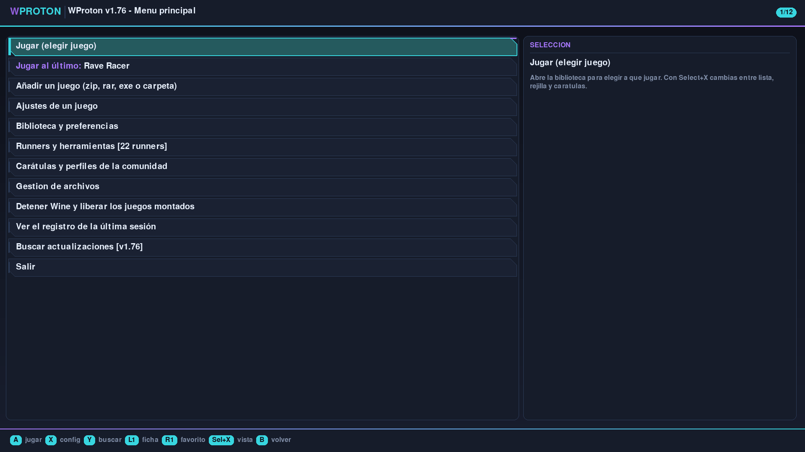
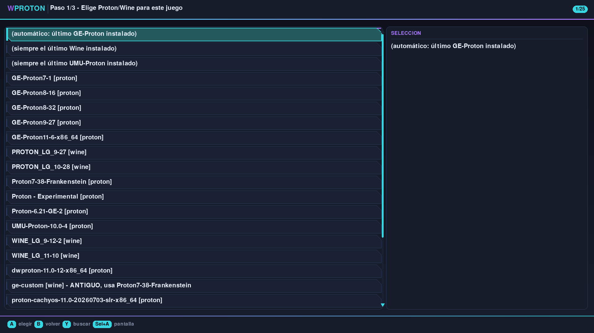
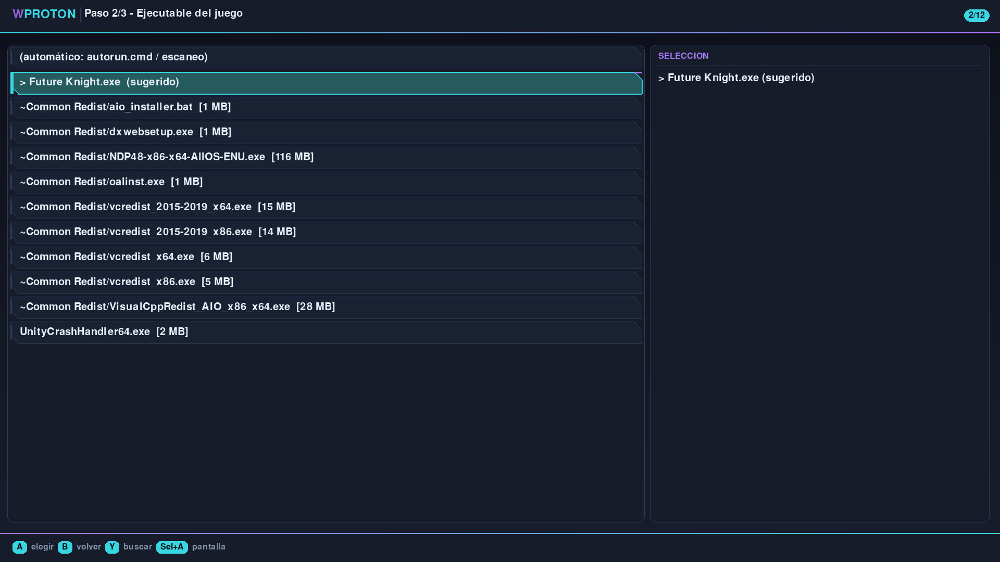
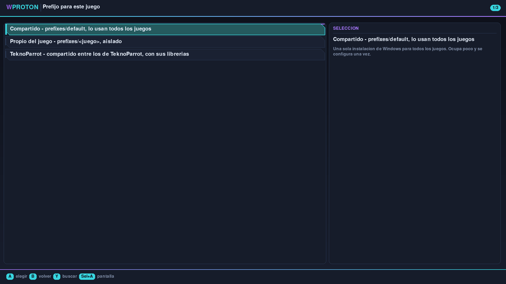
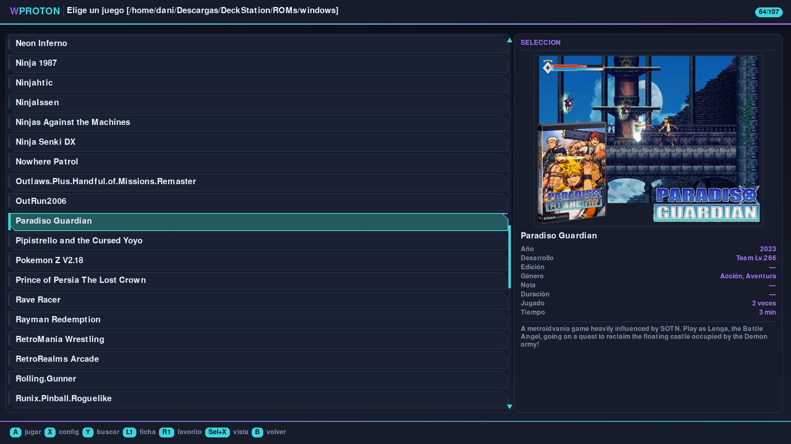
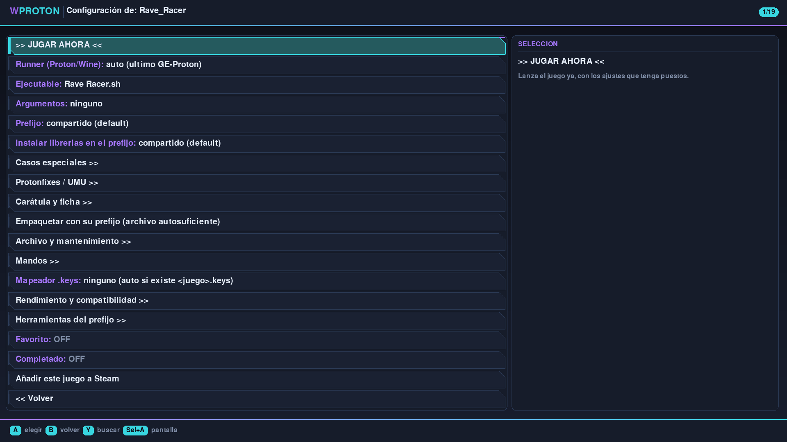
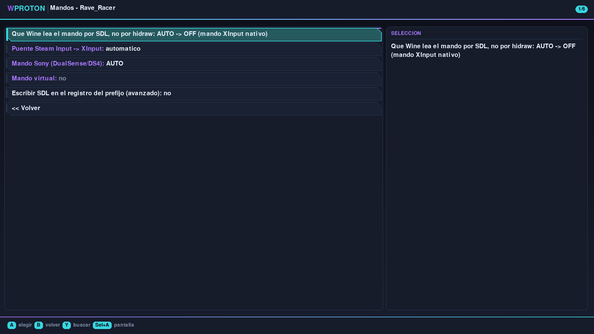
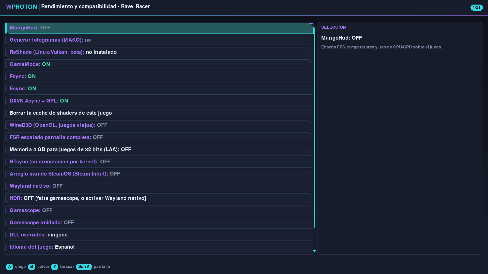
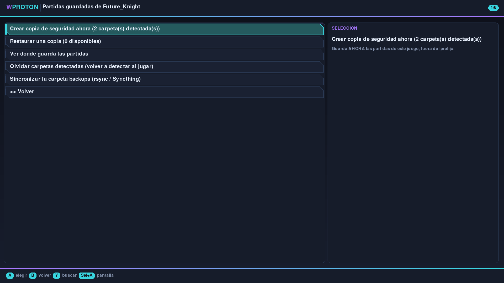

# WProton 2.0 — Guía de uso

> **Juega a tus juegos de Windows en Linux y en la Steam Deck, sin instalar
> nada y sin pelearte con Wine.**

Cada juego vive en un solo fichero `.wsquashfs` que lleva dentro todo lo que
necesita. Lo copias, lo llevas a otro equipo y funciona igual.

---

## Índice

1. [Qué necesitas](#qué-necesitas)
2. [Primeros pasos](#primeros-pasos)
3. [Añadir tu primer juego](#añadir-tu-primer-juego)
4. [Jugar](#jugar)
5. [Los ajustes que de verdad vas a tocar](#los-ajustes-que-de-verdad-vas-a-tocar)
6. [Partidas guardadas](#partidas-guardadas)
7. [Si algo no va](#si-algo-no-va)

---

## Qué necesitas

Un ordenador con Linux o una Steam Deck. Nada más: WProton se descarga los
runners (Proton y Wine) él solo la primera vez.

No hace falta ser administrador, no se instala nada en el sistema y todo vive
en una carpeta que puedes borrar cuando quieras.

---

## Primeros pasos

Descarga `wproton.sh`, dale permiso de ejecución y ábrelo. La primera vez te
preguntará **dónde tienes tus juegos** y se bajará lo necesario.

En la Steam Deck, añádelo a Steam como juego externo para poder abrirlo desde
el modo Juego con el mando.

---

## Añadir tu primer juego

**Menú principal → Añadir un juego.** Acepta:

| Qué tienes | Qué hacer |
|---|---|
| Una carpeta con el juego ya instalado | Elígela |
| Un `.zip`, `.rar` o `.7z` | Elígelo y se descomprime solo |
| Un instalador `.exe` | Se ejecuta dentro de su propio Wine |
| Un juego de Linux (`.sh` o `.AppImage`) | También vale |

Después, el asistente te hace **tres preguntas**: con qué Proton o Wine, cuál es
el ejecutable y si quiere prefijo propio o compartido. Si no lo tienes claro,
acepta lo que propone: acierta casi siempre.

Al final puedes **empaquetarlo a `.wsquashfs`**: un solo fichero, comprimido,
que ya no vuelves a tocar.

---

## Jugar

Elige el juego de la lista y pulsa **A** (o haz clic). Ya está.

| Mando | Teclado | Ratón | Qué hace |
|---|---|---|---|
| A | Intro | Clic izquierdo | Jugar / aceptar |
| B | Escape | Clic derecho | Volver |
| X | Espacio | Clic derecho (en la lista) | Ajustes del juego |
| Y | Tab | — | Buscar |
| L1 / R1 | F1 / F2 | — | Ficha / favorito |
| — | — | Rueda | Subir y bajar |

**Para salir de un juego**, mantén **Select cinco segundos**.

---

## Los ajustes que de verdad vas a tocar

*Ajustes del juego* tiene muchas opciones, pero en el día a día son cuatro:

**Runner (Proton/Wine).** Si un juego no arranca, probar otro runner es lo
primero. *Siempre el último GE-Proton* funciona con la mayoría.

**Prefijo.** Compartido para casi todo; propio si el juego instala cosas raras
o te da problemas.

**Mandos >>.** Solo si el juego no ve tu mando. Lo más útil ahí es el **mando
virtual**.

**Rendimiento y compatibilidad >>.** MangoHud para ver los fps, Gamescope para
forzar resolución, y *Borrar la caché de shaders* si el juego empieza a fallar
después de ir bien.

**Carátula y ficha >>.** La carátula 4:3 la baja WProton sola la primera vez que
cargas el juego, de su propio repositorio. Si la tuya no estaba todavía y la han
añadido después, aquí la pides: *Carátula 4:3: descargarla del repositorio*.

---

## Partidas guardadas

*Ajustes del juego → Archivo y mantenimiento → Partidas guardadas.*

WProton sabe dónde guarda cada juego y hace una copia en un `.zip`. Desde ahí
también puedes **restaurarla**, y llevártela a otro equipo aunque tenga las
carpetas en otro sitio.

**Entre dos equipos de la misma red**, en *Sincronizar*: uno comparte y el otro
se trae lo que le falte. Nunca se pisa una copia más nueva que la que ya tienes.

---

## Si algo no va

**El juego no arranca.** Prueba otro runner, y luego un prefijo propio.

**No ve el mando.** *Mandos → Mando virtual → Mando Xbox*. Y en el modo Juego
de la Deck, algunos juegos necesitan que desactives Steam Input para WProton
desde el menú de Steam.

**Va a tirones al principio y luego bien.** Es normal: está generando la caché
de shaders. Si no se suaviza nunca, bórrala en *Rendimiento y compatibilidad*.

**Cualquier otra cosa.** WProton guarda un registro detallado de cada partida en
`logs/`. Ahí suele estar la respuesta, y es lo que hay que adjuntar al pedir
ayuda.

---

## Gracias

Esta es la primera versión de WProton lista para todo el mundo.

**Muchas gracias a Michel, Fransis y MRDeu** por todas las horas de testeo que
habéis metido a WProton. Sin vosotros este proyecto no habría sido posible.
