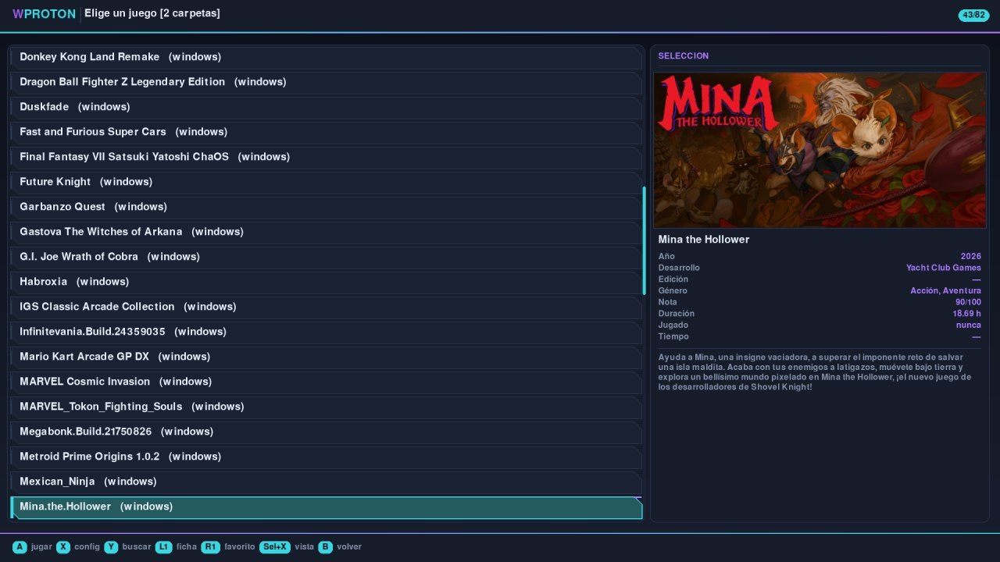
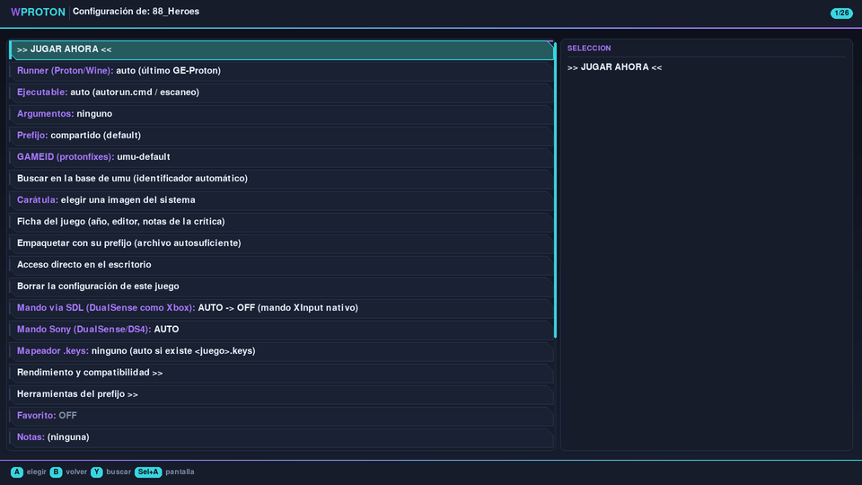
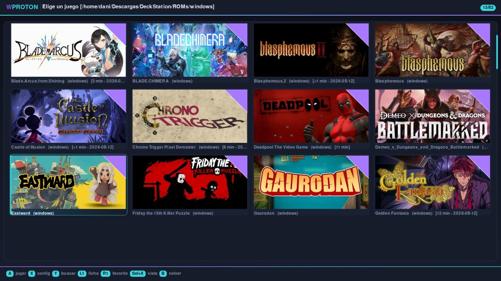

# Manual de uso de WProton

Guía práctica para empezar y para resolver los problemas más habituales.
Si solo quieres jugar, con los tres primeros apartados tienes de sobra.

---
## 1. Primeros pasos

### Antes de empezar

**Hace falta conexión a internet para instalar.** WProton se descarga a sí
mismo: su propio Python, los menús, umu-launcher, un GE-Proton y Proton
Frankenstein. Son unos cuantos cientos de megas, así que conviene hacerlo con
wifi y sin prisa.

**Para jugar no hace falta.** Una vez instalado, los juegos que ya tengas
funcionan sin conexión. Sí la necesitan cosas concretas: descargar más
runners, buscar carátulas, consultar la base de umu y traer las fichas de los
juegos.

### Instalar

Copia `wproton.sh` a una carpeta (por ejemplo `~/WProton`), dale permisos y ejecútalo:

```bash
chmod +x wproton.sh
./wproton.sh --setup
```

O más sencillo: **doble clic en `wproton.sh`** desde el explorador de archivos. Las dos formas hacen exactamente lo mismo; con doble clic te ahorras abrir la terminal.

`--setup` descarga todo eso **dentro de su carpeta**. No instala nada en el
sistema ni pide contraseña, y para desinstalarlo basta con borrar la carpeta.

La primera vez tarda unos minutos, según tu conexión. Si se corta a medias,
vuelve a lanzar `--setup`: continúa desde donde estaba. Después, arranca con:

```bash
./wproton.sh
```

Al abrirlo por primera vez te preguntará **dónde tienes los juegos**, con dos opciones: usar la carpeta `games/` de WProton, o buscar otra (se abre el navegador y la eliges con el mando). Se puede cambiar después en *Biblioteca y preferencias → Carpeta de juegos*.

Los menús se abren **a pantalla completa**. Si prefieres verlos en ventana, pulsa **Select + A** (o **F11**) y quedará recordado.

### Añadir tu primer juego

**Si ya tienes un juego empaquetado** (`.wsquashfs`, `.squashfs` o `.dwarfs`), no hay nada que preparar: **cópialo a tu carpeta de juegos —`games/` por defecto— y ya aparece en *Jugar***. También puedes abrirlo directamente desde el navegador de archivos o desde la línea de comandos:

```bash
./wproton.sh "Mi juego.wsquashfs"
```

Esos archivos son la forma en que WProton guarda los juegos: **un solo fichero comprimido** que se monta al vuelo, se juega en modo solo lectura y **guarda las partidas aparte**, sin modificarse nunca. Si te pasan uno hecho por otra persona, funciona igual.

**Si tienes otro formato**, WProton lo convierte por ti: menú principal → **Añadir un juego**, y se abre un navegador de archivos donde puedes elegir:

| Lo que tienes | Qué hace WProton |
|---|---|
| Un `.wsquashfs`, `.squashfs` o `.dwarfs` | Nada: se juega tal cual (basta con copiarlo a `games/`) |
| Un `.zip`, `.rar` o `.7z` | Lo descomprime y lo convierte en un archivo de juego |
| Un instalador de GOG (`setup_*.exe`) | Lo instala solo, sin ventanas, y lo empaqueta |
| Una carpeta con el juego ya instalado | Te deja probarlo y luego empaquetarlo |
| Un `.exe` suelto | Igual, tomando su carpeta como raíz |
| Un `.bat` o `.cmd` | Igual: algunos juegos arrancan con un script en vez de un ejecutable |

> Las carpetas que estén **dentro de tu carpeta de juegos** salen solas en la lista, sin tener que añadirlas: basta con que tengan un ejecutable, un `autorun.cmd`, un `drive_c` o que acaben en `.pc`.

> Empaquetar no es obligatorio: una carpeta o un `.exe` se pueden jugar tal cual, sin convertir nada. Empaquetar solo sirve para tenerlo todo en un fichero, que ocupa menos y es más cómodo de mover.

Cuando el juego esté en una carpeta, aparece este menú:

- **Probar el juego (sin empaquetar)** — lánzalo para ver si funciona.
- **Configurar** — cambia el Proton, el prefijo u otras opciones y vuelve a probar.
- **Empaquetar a wsquashfs** — cuando funcione, comprímelo en un solo archivo.

Puedes probar y ajustar tantas veces como quieras antes de empaquetar. **La configuración que hagas durante las pruebas se conserva** en el juego final.

### Prefijos que vienen de Batocera

Batocera **corre como root**, así que un prefijo hecho allí guarda los datos
del juego en `drive_c/users/root/`. En un PC normal, Proton usa `steamuser` y
Wine usa tu nombre: el juego mira ahí, no encuentra nada y arranca como recién
instalado (sin idioma, sin configuración).

WProton lo enlaza solo al preparar el prefijo. Si tu `steamuser` ya tiene
ficheros propios, no toca nada y avisa, para no mezclar partidas.

También puede pasar que la superposición **tape** carpetas: Wine borra y
rehace las de usuario, y a partir de ahí lo que trae el archivo deja de verse.
Las de usuario se destapan solas; para el resto hay *Gestión de archivos →
Reparar carpetas tapadas*.

### Jugar

Menú principal → **Jugar**. Ahí salen todos los juegos de tu carpeta de juegos, ya sean archivos empaquetados o carpetas. Elige uno con el mando y pulsa **A**.

> ¿Dónde está esa carpeta? La primera vez que abres WProton te pregunta dónde tienes los juegos. Si no eliges ninguna, usa `games/`, dentro de la propia carpeta de WProton. Puedes cambiarla cuando quieras en *Biblioteca y preferencias → Carpeta de juegos*.

La primera vez que lances un juego, un asistente te preguntará tres cosas: qué Proton usar, cuál es el ejecutable y unas opciones básicas. Si no sabes qué contestar, acepta lo que viene marcado: funciona en la mayoría de casos.

---

## 2. Manejo con el mando

| Botón | Qué hace |
|---|---|
| Cruceta o stick | Moverse |
| **Izquierda / derecha** | Saltar una pantalla entera (en la lista) |
| **A** | Elegir |
| **B** | Volver atrás un nivel |
| **Select** | Volver al menú principal desde donde estés (y ahí, salir) |
| **X** | Configurar el juego resaltado (en la lista de juegos) |
| **Y** | Buscar |
| **Select + A** | Pantalla completa / ventana |
| **Select + X** | Cambiar de vista: lista → vertical → panorámica → 4:3 |
| **X** sobre *Jugar al último* | Configurar ese juego sin abrir la lista |
| **Select** (5 s) | (con un juego abierto) Cerrarlo y volver al menú |
| **Select + Y** | (con un juego abierto) Recuperar el foco si se ha ido detrás |

Con bibliotecas grandes, **izquierda y derecha** saltan una pantalla completa en
vez de ir de uno en uno, y el puntero se queda en la misma fila para no perder
el hilo.

**Select** vuelve al menú principal esté donde esté, sin tener que ir dando
atrás con **B** menú por menú. Y estando ya en el principal, **cierra WProton**
(preguntando antes). Es una pulsación corta: mantenerlo sigue siendo lo que
cierra un juego.

**Buscar entre muchos juegos**: pulsa **Y** y aparece un teclado en pantalla; o, si tienes teclado, empieza a escribir directamente. Se filtran los juegos cuyo nombre *empiece* por lo que escribas.

Ese mismo teclado en pantalla se usa para escribir argumentos, notas o cualquier otro texto, así que no hace falta teclado físico para nada.

---



## 3. Ajustes de un juego

Desde la lista de juegos, ponte encima de uno y pulsa **X** (o entra en *Ajustes de un juego*).



Arriba está lo del día a día. Lo que casi nunca se toca vive en dos submenús: **Rendimiento y compatibilidad** (MangoHud, Fsync, DXVK, FSR, gamescope…) y **Herramientas del prefijo** (winecfg, winetricks, dgVoodoo2, OptiScaler).

Lo más útil:

**Ejecutable** — qué se lanza. **Lo que elijas aquí es lo que arranca**: si ese fichero no está, WProton avisa y no arranca ningún otro, porque jugar a algo distinto de lo que elegiste es peor que no jugar. Déjalo en «automático» si prefieres que decida él.

Si el juego arranca con un `.bat`, elígelo igual: WProton lo **lee** y hace lo que dice —abrir el ejecutable que menciona, con sus argumentos— en vez de ejecutarlo. Si el `.bat` instala algo (copia ficheros, toca el registro), eso se hace una sola vez y después se abre el juego directamente. Lo mismo con los lanzadores `.ahk` de AutoHotkey, habituales en los recopilatorios: se leen y se traducen a ajustes del perfil.

**Runner (Proton/Wine)** — con qué se ejecuta. Si un juego no arranca, esto es lo primero que conviene cambiar: prueba otro GE-Proton o una versión más antigua.

**Casos especiales** — lo que solo necesita algún juego raro. La fila resume lo que tengas puesto:

- **Unidades de Windows**: darle al juego una letra propia (`D:`, `E:`…), para los que buscan sus datos en una ruta corta.
- **El juego debe estar en `C:\`**: para los que miran `C:\<carpeta>\...` con la ruta escrita a fuego. La carpeta se enlaza dentro de `C:`, no se copia.
- **Ejecutable acompañante**: un programa que se abre antes del juego y se cierra con él.
- **Versión de Windows**: de 98 a 11. Algunos juegos viejos se niegan a arrancar en «Windows 10»; algunos modernos no arrancan en XP.
- **Escritorio virtual**: encierra el juego en una ventana con su propio escritorio, para los que cambian la resolución y dejan la pantalla rota.
- **OpenGL por Vulkan (Zink)**: para juegos OpenGL antiguos cuyos shaders el driver normal no consigue compilar.

Nada de esto añade ajustes nuevos al perfil: se guarda con los que ya había.

**Argumentos** — parámetros que necesita el juego, por ejemplo `-novr` o `-windowed`.

**Prefijo** — dónde se guarda la "instalación de Windows" del juego:
- *Compartido*: todos los juegos usan el mismo. Ocupa menos y va bien casi siempre.
- *Propio del juego*: uno exclusivo. Útil si un juego necesita librerías que estorban a otros.
- *Incluido en el archivo*: si el juego trae el suyo (estilo Batocera).

**Idioma del juego** — se elige de una lista y viene en **español** de fábrica.
Muchos juegos miran el idioma del sistema para decidir en cuál arrancan. Si
tu sistema no tiene ese idioma generado, WProton te avisa: Wine suele
apañarse igual, pero si el juego sigue saliendo en inglés esa es la razón más
probable.

**DLL overrides** — para los juegos que necesitan cargar una DLL propia en vez
de la de Wine: dgVoodoo2, ReShade, OptiScaler, cargadores de mods como BepInEx.
Ya no hace falta escribir la cadena a mano:

- *Elegir de una lista* — las cinco habituales (`dinput8`, `d3d9`, `dxgi`,
  `winhttp`, `winmm`) y las que ya tengas puestas, marcadas.
- *Buscar las DLL que hay en el juego* — mira junto al ejecutable. Si alguien
  dejó ahí un `dinput8.dll`, es porque quiere que se cargue.
- *Escribir a mano* y *Quitar todos*, que avisa de lo que se lleva por delante.

Lo que ya tuvieras puesto **nunca se pierde**: la lista muestra la unión de lo
tuyo y lo que se ofrece, con tus valores intactos.

> ¿Se está aplicando de verdad? Pon `DIAG_DLL=1` en `settings.conf`, juega un
> minuto y mira el registro: dirá si cada DLL se cargó la nativa o la de Wine.
> Déjalo apagado el resto del tiempo, que habla muchísimo.

**HDR** — en *Rendimiento y compatibilidad*. Pone las variables que hacen falta
y se lo pide a gamescope. La propia fila del menú te dice si va a poder verse:
si no hay gamescope ni sesión Wayland, no hay HDR por mucho que lo enciendas.
El monitor también tiene que serlo, y el juego traerlo.

**Mando vía SDL** — en automático. Se activa solo con mandos que lo necesitan (DualSense, DualShock, mandos de Nintendo) y se queda apagado con mandos XInput como los de la Steam Deck o la Legion Go.

**Buscar en la base de umu** — consulta la base de datos de
[umu](https://github.com/Open-Wine-Components/umu-database) y, si encuentra el
juego, pone el identificador que necesita protonfixes para aplicarle sus
arreglos. Al añadir un juego nuevo lo propone solo.

**Carátula** — hay tres formas: descargarlas todas de golpe desde *Carátulas y
perfiles*, **buscar la de ese juego por nombre** (si el fichero se llama de
forma rara y la búsqueda automática falla), o elegir una imagen de tu disco. Hay
dos, y cada una vive en su carpeta con el nombre del juego:

| Carpeta | Para qué |
|---|---|
| `covers/` | Vertical (2:3), para la lista y la rejilla clásica |
| `covers_wide/` | Panorámica, tipo cabecera de Steam |
| `covers_43/` | Cuadrada 4:3 (640x480) |
| `metadata/` | Ficha del juego y duración (no son imágenes) |

Cada vista usa su carpeta, y en la vista de lista puedes elegir cuál se
enseña en el panel (*Biblioteca y preferencias → Carátula en la vista de
lista*). Si un juego no tiene la de esa forma, se usa la vertical. Las
imágenes nunca se deforman: se centran en su casilla.

Si ya tienes una colección de carátulas, cópiala en la carpeta que
corresponda: los ficheros se llaman igual que el juego, con espacios o con
guiones bajos — las dos formas valen.

> Para las descargas de SteamGridDB hace falta una clave gratuita
> (steamgriddb.com → Profile → Preferences → API). En vez de teclearla con el
> mando, puedes pegarla en un fichero de texto y dejarlo junto a `wproton.sh`:
> WProton la recoge, la guarda a buen recaudo y borra el fichero.

**Descargar datos de los juegos** (en *Biblioteca y preferencias*) hace lo
mismo con la información: baja de una vez la **ficha de Steam** (año, género,
nota, descripción) y la **duración de HowLongToBeat** de todos los juegos que
no la tengan. Antes solo se conseguían de uno en uno, entrando en la ficha de
cada juego.

El panel de la derecha enseña la carátula, la ficha y la sinopsis:


### La nota, y los juegos que no están en Steam

La **nota** que trae Steam es la de Metacritic, y solo la incluye si el juego
la tiene en su ficha: los juegos viejos casi nunca. Y un juego que no esté en
Steam se queda sin ficha ninguna.

Para esos dos casos se puede poner una **clave de RAWG** (*Biblioteca y
preferencias → Clave de RAWG*). Es gratuita y **opcional**: sin ella todo
funciona igual, solo con los datos de Steam.

RAWG es siempre la fuente **secundaria**: se consulta después de Steam y solo
rellena lo que falte, porque la ficha de Steam trae la sinopsis en español y
datos más completos. Cada fuente guarda su propio fichero, así que se sabe
siempre de dónde vino cada dato.

> Metacritic no tiene API propia. Lo que se anuncia como tal son raspadores de
> su web (que se rompen cuando cambian la página) o servicios de pago. RAWG
> publica esa nota en su API, que es estable y legal. Los datos son suyos y
> hay que citarlos como fuente.

Se puede pedir solo una de las dos. No se vuelve a descargar lo que ya está,
así que se puede repetir cuando añadas juegos nuevos. Los que no aparezcan
suelen tener el nombre del archivo muy distinto al del juego: se arregla
renombrando el `.wsquashfs`.

**Importar un fichero `.reg`** (en *Herramientas del prefijo*) — mete claves en
el registro del prefijo. El uso más común es cambiar el idioma de un juego que
lo guarda ahí y no en un menú. Antes de aplicarlo te enseña qué lleva dentro, y
**guarda una copia del registro** en `wp_registro_<fecha>/` dentro del prefijo,
porque una vez importado no hay deshacer.

**Proton oficial de Steam** — en *Runners y herramientas → Descargar runners*.

Valve **no publica Proton para descargar por su cuenta**: solo se consigue a
través de Steam. Así que WProton no lo descarga: busca los que Steam ya tiene
instalados —incluidos los de la tarjeta o de otro disco— y los enlaza.

No ocupa nada, porque es un enlace a la copia de Steam, y se actualiza cuando
Steam lo actualice. Si algún día desinstalas ese Proton desde Steam, el enlace
se queda apuntando a la nada: basta con volver y elegir otro.

> Si no aparece ninguno, instálalo desde Steam: *Biblioteca → Herramientas →
> Proton*.

**Instalar librerías** — los redistribuibles de Windows. Está en la pantalla
de ajustes del juego y también en *Herramientas del prefijo*: desde ahí va
directo al prefijo de ese juego, sin tener que volver a elegirlo. (En el menú
principal sigue estando, para cuando quieras tocar otro prefijo.)

La fila dice a qué prefijo va a instalar, y si es el **compartido** pide
confirmación: lo que metas ahí lo verán todos los juegos en ese modo.

Primero se elige la categoría, para no tener que buscar entre cuarenta entradas:

- *Visual C++ y .NET* — lo que piden casi todos
- *DirectX y shaders*
- *Códecs de vídeo y sonido*
- *Otros* — fuentes, PhysX, XNA, Unreal
- *Verlo todo en una sola lista*

La de **códecs** es la que suele faltar cuando un juego arranca pero **las
cinemáticas salen en negro o sin sonido**.

| Si el juego... | Prueba con |
|---|---|
| No reproduce ningún vídeo | `quartz`, o el pack `directshow` |
| Es de los 2000 y pide Media Player | `wmp11` (o `wmp10`/`wmp9` si es más viejo) |
| Tiene intros de los 90 | `icodecs`, `cinepak` |
| Vídeo sin sonido | `l3codecx` |
| Cinemáticas `.wmv` | `wmv9vcm` |
| Nada de lo anterior funciona | `lavfilters`, o el pack `allcodecs` |

> De los tres Windows Media Player, **marca solo uno**: se pisan entre ellos.
> Si marcas varios, WProton se queda con el más nuevo.

Se puede elegir en qué prefijo van: el compartido, el de un juego concreto, o cualquiera de los que
tengas. Se instalan de uno en uno y la barra avanza de verdad; si alguno falla,
sigue con el resto y al final dice cuál falló.

**Empaquetar con su prefijo** — crea un archivo **autosuficiente**: lleva dentro
el juego y su prefijo, así que se copia a otro equipo y funciona sin instalar
nada. Necesita que el juego use un prefijo propio (no el compartido) y que lo
hayas probado antes. El original no se toca.

**Notas** — un recordatorio tuyo: *"necesita -novr"*, *"con GE 9-27 va mejor"*.

**Borrar la configuración de este juego** — quita sus ajustes y empieza de
cero. El juego y las partidas no se tocan, y queda una copia `.bak` por si
acaso. También están todos juntos en *Perfiles guardados*.

**Acceso directo en el escritorio** — crea un icono que lanza ese juego
directamente, con su carátula. Útil para los que juegas a menudo.

**Favorito** — lo pone al principio de la lista, con una cinta en la carátula.

**Partidas guardadas** — copias de seguridad (ver apartado 5).

---

## 4. Si un juego no arranca

Prueba en este orden:

1. **Otro runner.** Muchos fallos se arreglan con un GE-Proton distinto. Los juegos antiguos suelen ir mejor con versiones antiguas (por ejemplo GE-Proton 9-27).
2. **Instalar librerías.** *Runners y herramientas → Instalar librerías de Windows*. Marca `vcrun2022`; si el juego es de Unreal, también el pack de prerrequisitos; PhysX si lo pide.
3. **Argumentos.** Algunos juegos necesitan `-novr` u otros parámetros para no arrancar en un modo que no tienes.
4. **Prefijo propio.** Si sospechas que otro juego le ha ensuciado el prefijo compartido. Con una excepción: si el juego trae **su propio prefijo** (los de Batocera), no lo cambies — trae el registro y las DLL que necesita.
5. **Mirar el registro.** *Ver el registro de la última sesión*: las últimas líneas suelen decir qué falta (una DLL, una librería…).

### WProton te dice qué hacer

Cuando un juego falla, WProton lee el final del registro y, si reconoce el
fallo, **dice qué hacer y dónde**, en vez de enseñarte un código. Cada caso que
reconoce es uno que ya le pasó a alguien:

| Lo que ves | Lo que es |
|---|---|
| `rc=53` y nada más | El juego es de .NET y Mono está apagado |
| «No encuentro los efectos» (ReShade) | Falta `d3dcompiler_47` |
| Un error genérico al arrancar | Falta un `d3dx9_XX` concreto, o un Visual C++ de una versión concreta |
| `rc=1` a los pocos segundos | El prefijo es de 32 bits y el runner no lo admite |
| El juego se sale solo al rato | Se acabó la memoria de 32 bits, o los shaders no compilan |
| Se cierra limpio en segundos | El lanzador arrancó y el juego reventó |

También avisa cuando el registro **repite la misma línea miles de veces**,
aunque la partida haya durado minutos: eso siempre significa que algo va mal.

Y si **no** reconoce el fallo, no se inventa nada.

Si un juego se cierra en menos de diez segundos, WProton te enseña automáticamente el final del registro.

**Perfiles de la comunidad**: en *Carátulas y perfiles de la comunidad* puedes descargar configuraciones ya probadas para juegos problemáticos. Vienen con notas explicando por qué necesitan esos ajustes.

---

## 5. Partidas guardadas

WProton **aprende dónde guarda cada juego**. Al jugar, observa qué ficheros escribe y localiza la carpeta exacta (por ejemplo `AppData/Roaming/Yacht Club Games/Mina the Hollower`), ignorando cachés y temporales.

En *Ajustes de un juego → Partidas guardadas*:

- **Crear copia de seguridad ahora** — genera un zip con fecha en `backups/`.
- **Restaurar una copia** — vuelve a una copia anterior (te pide confirmación).
- **Ver dónde guarda las partidas** — comprueba qué se está copiando.
- **Sincronizar** — con *rsync* a otro equipo o disco, o preparando la carpeta para *Syncthing*.

> Si acabas de añadir un juego, juega una partida antes de hacer la copia: hasta entonces WProton aún no sabe dónde guarda.

---

## 6. Personalizar el aspecto

Si vienes de Batocera o ES-DE y ya tienes tus carátulas escaneadas, WProton las
usa tal cual: busca la carpeta `images` (o `media`) junto a los juegos. No hay
que copiar nada. Si además pones una carátula propia en `covers/`, esa manda.


En *Biblioteca y preferencias*:

- **Vista de juegos**: lista o **rejilla de carátulas**. En la lista, el panel de la derecha muestra la carátula del juego resaltado y sus datos.


La vista de **carátulas panorámicas** enseña menos juegos a la vez, pero se
reconocen mejor. La cinta de la esquina marca los favoritos, y debajo de
cada uno sale el tiempo jugado y cuándo fue la última vez:


- **Carátulas por fila**: automático (se adapta a tu pantalla) o de 4 a 8. Menos carátulas por fila significa carátulas más grandes; más, ver más juegos de un vistazo.
- **Descargar carátulas**: necesita una clave gratuita de [SteamGridDB](https://www.steamgriddb.com) (Perfil → Preferences → API). Se pide una sola vez.
- **Tema**: *moderno* (paneles y acento neón, el que viene puesto), *clásico* (sobrio) o *arcade* (synthwave con efecto CRT).
- **Tamaño de la letra**: normal, grande o muy grande. En consolas portátiles se agradece "grande".
- **Ordenar juegos por**: nombre, últimos jugados o más jugados. Los favoritos van siempre primero.
- **Idioma**: castellano o inglés.
- **Copia de tu configuración**: exporta perfiles, ajustes y carátulas a un zip para llevarlos a otro equipo.

---

## 7. Modo "solo jugar"

Para quien solo quiere jugar y no tocar nada. Edita `settings.conf` y pon:

```
DIRECT_PLAY=1
```

Al abrir WProton irás directo a la lista de juegos; al salir de ella, el programa se cierra. Para volver al menú completo: `./wproton.sh --menu`, o vuelve a poner `DIRECT_PLAY=0`.

Combinado con la vista de rejilla y las carátulas, queda como un lanzador de consola.

---

## 8. Gestión de archivos

*Gestión de archivos* en el menú principal:

- **Mostrar el tamaño de WProton** — desglose por partes y espacio libre.
- **Tamaño por juego** — cada juego con sus partidas y su prefijo.
- **Limpiar caché de shaders** — se puede borrar sin miedo: se regenera sola.
- **Buscar prefijos y partidas huérfanas** — restos de juegos que ya borraste.
- **Borrar copias de partidas antiguas** — conserva las tres más recientes de cada juego.
- **Reparar carpetas tapadas** — cuando algo borra y rehace una carpeta, el juego
  deja de ver lo que trae su propio archivo (idiomas, configuración).
- **Copiar o mover ficheros** — ver abajo.

Antes de importar o empaquetar, WProton comprueba que haya sitio y avisa si no lo hay.

### Copiar o mover ficheros

Para llevar algo de un sitio a otro sin salir de WProton: una partida guardada,
un `.keys`, una carátula, un fichero que le falte a un juego.

Eliges **qué** copiar y **dónde** ponerlo, y ya. Vale tanto para ficheros sueltos
como para carpetas enteras.

**No borra nada.** Si te equivocas, el original sigue donde estaba. Y hay tres
avisos por si acaso: no deja copiar algo sobre sí mismo, ni una carpeta dentro de
sí misma —se copiaría sin fin hasta llenar el disco—, y pregunta antes de
reemplazar algo que ya exista.

> Si borras un prefijo desde aquí, WProton guarda antes una copia de lo que haya
> en `users/` (partidas y configuración). En el compartido son las de **todos** los
> juegos que lo usen.

---

## 9. Juegos de Linux

Un `.wsquashfs` no tiene por qué llevar un juego de Windows. Si dentro hay un
juego de **Linux**, WProton lo detecta y lo lanza tal cual: sin Wine, sin
Proton y sin prefijo.

No hay que hacer nada especial. Añades el juego como cualquier otro —eligiendo
su `.sh` o su ejecutable— y WProton se encarga del resto:

- **Lo detecta solo.** Si hay algún `.exe` por medio, lo trata como juego de
  Windows: eso manda siempre.
- **No pregunta qué ejecutar.** Estos juegos tienen un lanzador y punto.
- **No escribe `autorun.cmd`**, que es una convención de Wine y aquí no pinta
  nada.

### Dónde guardan sus cosas

Un juego de Linux escribe sus ajustes y partidas en tu carpeta personal
(`~/.config`, `~/.local`). WProton los desvía a una carpeta propia, como hace
el prefijo con los juegos de Windows:

- **`WProton.home`** — una sola para todos, si el juego usa el prefijo
  compartido (lo normal).
- **`<juego>.home`** — solo suya, si le pones *prefijo propio del juego*.

Así tu carpeta personal no se llena, y para llevarte un juego a otro sitio te
llevas su carpeta.

> Las opciones de Wine —runner, prefijo, librerías, GAMEID— no aparecen en la
> configuración de estos juegos: ahí no hacen nada.

**Si un juego no arranca** y el registro habla de `GLIBC` o de una biblioteca
que falta, es que se compiló para otra distribución. Eso no lo arregla WProton;
suele resolverse con una versión del juego más reciente.

---

## 10. Juegos de TeknoParrot

Los juegos de recreativa que usan **TeknoParrot** funcionan sin preparar nada.

Estos juegos suelen venir de Batocera con un `.bat` que comprueba en qué ruta
está la ISO y copia uno de dos perfiles ya rellenos. Esas rutas no existen aquí
—el juego se monta en una carpeta temporal distinta cada vez—, así que WProton
lo resuelve por su cuenta al lanzarlo:

- Da a la carpeta del juego **su propia unidad** (`D:`), para que las rutas del
  perfil sean cortas, que es lo que TeknoParrot reconoce.
- Rellena la ruta del juego en el perfil de `UserProfiles`, aunque venga vacía.
- Se salta el `.bat` y llama a TeknoParrot directamente con ese perfil.

**El fichero original no se pierde.** Antes de tocar nada se guarda una copia
(`<perfil>.xml.wproton_original`) y al salir del juego se devuelve a su sitio,
así que **el juego sigue funcionando en Batocera** sin hacer nada. Si WProton se
cierra de golpe, se restaura al arrancar la próxima vez.

> TeknoParrot es un **lanzador**: su ventana se queda abierta mientras el juego
> corre. Para volver a WProton, ciérrala o mantén **Select**.

Si el perfil pide un fichero que no está en el juego, WProton lo dice con el
nombre en vez de fallar en silencio.

### Lo que WProton hace solo

Tres cosas que hacían falta y no eran evidentes:

**GameMode y MangoHud se apagan.** El cargador de los juegos de Raw Thrills
(BudgieLoader) **se cierra al leer los avisos** que esos dos programas escriben
en la salida: los toma por errores fatales. Se apagan solo cuando el lanzador es
TeknoParrot, y sin tocar tus ajustes.

**Los prefijos de 32 bits funcionan.** Los `.wsquashfs` que vienen de Batocera
traen prefijos de 32 bits. Antes fallaban con `rc=1` a los pocos segundos porque
WProton exportaba `WINEARCH=win32`, que es lo que hace que los Wine modernos se
nieguen a arrancar. Ya no se exporta: la arquitectura está en el registro del
prefijo y Wine la lee de ahí.

**Lo que el paquete trae en `drive_c` se ve desde `C:\`.** El perfil XML de un
juego suele decir `C:\game\game.exe`. Si usas un prefijo distinto del incluido,
ese `C:` es otro sitio y el juego no encontraría nada: WProton enlaza las
carpetas del paquete dentro del `C:` que se esté usando.

### Un prefijo para todos los juegos de TeknoParrot

En **Biblioteca y preferencias → Prefijo de TeknoParrot** se crea uno con todas
sus librerías —Visual C++, compiladores de shaders, XACT, varios .NET y DXVK— de
una vez y sin preguntar. Tarda un rato la primera vez; después cualquier juego
lo elige en **Ajustes del juego → Prefijo → TeknoParrot** y lo reutiliza.

Si alguna librería falla, el prefijo se marca como listo igual —con las demás
funciona— y la fila del menú dice cuál falta, para reintentar solo esa.

### Qué se sabe de cada juego

**Biblioteca y preferencias → Base de datos de arcades.** Reúne lo documentado
sobre TeknoParrot, JConfig, RConfig, iDMac, DemulShooter, Taito Type X, Sega
Ring y bastantes títulos concretos. Se busca por nombre —del juego, del
ejecutable o de la plataforma— o se mira el listado entero, y **cada ficha dice
de qué fuente sale**.

Con un juego delante, la ficha está en **Ajustes del juego → Instalar librerías
→ Qué se sabe de este juego**, con la opción de instalar lo que necesite.

Un par de cosas que están ahí y ahorran tiempo:

- **JConfig**: si no hay un mando conectado al arrancar, el juego se cierra con
  el error **1280**. Conecta el mando antes de lanzar.
- **Sega Rally 3, la serie WMMT y Mario Kart GP DX** necesitan **GStreamer y sus
  plugins instalados en el sistema** para los vídeos.

---

## 11. Formatos de archivo

WProton puede empaquetar en dos formatos (*Biblioteca y preferencias → Formato al empaquetar*):

- **wsquashfs** — el de siempre, compatible con Batocera y PortProton.
- **dwarfs** — comprime más. Se nota sobre todo en juegos con muchos archivos parecidos; en juegos cuyos datos ya vienen comprimidos, la diferencia es pequeña.

Los dos se montan igual de rápido y se usan exactamente igual. Puedes tener juegos de los dos tipos mezclados.

---

## 12. Preguntas frecuentes

**¿Puedo mover WProton a otro sitio o a un pendrive?**
Sí. Si en `settings.conf` usas una ruta relativa —`GAMES_PATH="games"`— puedes mover la carpeta entera y todo seguirá funcionando.

**¿Dónde están mis partidas?**
En `wsquashfs/overlays/<juego>/upper/` y, según el juego, dentro de su prefijo. Esa carpeta **no se borra nunca** al reempaquetar un juego.

**¿Puedo lanzar los juegos desde Steam?**
Sí: *Ajustes de un juego → Añadir este juego a Steam*. Aparecerá en tu biblioteca como juego no-Steam, con su carátula. Hazlo con Steam cerrado.

**¿Y desde EmulationStation o DeckStation?**
Apunta el lanzador a `wproton.sh %ROM%`.

**El mando funciona en los menús pero no dentro del juego.**
Mira el ajuste *Mando vía SDL* del juego. En automático debería acertar, pero puedes forzarlo a ON (mandos de PlayStation) u OFF (mandos XInput).

**¿Se llenará la carpeta `logs/` de ficheros?**
No: WProton borra los registros que tengan más de dos días.

**Mi mando de PlayStation no responde (DualSense o DualShock 4).**
Desde GE-Proton 11-4 los mandos de Sony se leen por `/dev/hidraw`, y en muchos
sistemas esos dispositivos no son legibles por el usuario.

La forma cómoda: *Runners y herramientas → Arreglar permisos del mando*.
WProton deja el fichero preparado y te dice los comandos exactos para tu
sistema, que solo tienes que copiar en una terminal.

> Los comandos de abajo funcionan en cualquier terminal. Si en algún sitio ves
> instrucciones con `sudo tee ... <<'EOF'`, eso es sintaxis de **bash** y da un
> error de sintaxis en **fish**, que es el shell por defecto de CachyOS.

A mano, en una distribución normal:

```bash
sudo cp runtime/70-wproton-mandos.rules /etc/udev/rules.d/
sudo udevadm control --reload-rules && sudo udevadm trigger
```

**En SteamOS hay dos pasos más**, y son la causa habitual de que "el comando no
funcione": el sistema de ficheros es de solo lectura y hay que desbloquearlo,
y el usuario `deck` no trae contraseña de fábrica, así que `sudo` no puede
funcionar hasta que se crea una:

```bash
passwd                          # solo la primera vez, crea tu contraseña
sudo steamos-readonly disable
sudo cp runtime/70-wproton-mandos.rules /etc/udev/rules.d/
sudo udevadm control --reload-rules && sudo udevadm trigger
sudo steamos-readonly enable
```

Después, desconecta y vuelve a conectar el mando.

**El mando se ve pero el juego no responde a ningún botón.**
Puede ser el modo escritorio de Steam: ahí los botones mandan teclas, no
botones, así que un juego que espere un mando no recibe nada. Mantén pulsado
Start unos segundos para cambiarlo, o usa *Ajustes del juego → Mapeador .keys
→ Mando virtual → Traducir el modo escritorio de Steam*.

**El juego no hace caso a la cruceta, o mi mando le llega raro.**
En *Ajustes del juego → Mapeador .keys → Mando virtual*. WProton crea un mando
"de mentira" y le copia el tuyo. Empieza por **Mando Xbox**, que arregla los
mandos que llegan de forma rara sin cambiar nada más. Si el juego lee la
cruceta pero no la usa, prueba **+ cruceta al stick**. Y para juegos antiguos
que se aceleran solos, **Mando clásico**.

**Quiero que un juego responda a teclas concretas del teclado.**
En *Ajustes del juego → Mapeador .keys*.

Si el juego ya trae uno de Batocera, WProton lo encuentra solo, esté donde
esté: junto al `.wsquashfs` con el nombre del juego, o dentro de la carpeta
`.pc` llamado `padto.keys`. Lo que edites tú manda sobre los dos. Si el juego ya tiene un `.keys`, lo
primero que ofrece es **ver las teclas que tiene asignadas**, sin abrir el
fichero:

```
Ver las teclas asignadas  (4)

    Hotkey + Start             ->  Alt + F4
    A                          ->  Espacio
    L1                         ->  E
    Stick izq. arriba          ->  Flecha arriba
```

Si el `.keys` **sustituye al mando** —es decir, si asigna teclas al movimiento:
sticks, cruceta o gatillos— WProton captura el mando para que el juego solo vea
el teclado, que es lo que hace Batocera. Sin eso, un juego con soporte de mando
usa el mando e ignora las teclas.

Se decide solo mirando el fichero, así que normalmente no hay que tocar nada. Si
un juego concreto lo lleva mal, está en *Mapeador .keys → El juego NO ve el mando*, con tres opciones y una explicación de cada una.

> El ratón también funciona: si el `.keys` asigna un stick al ratón, WProton
> crea un ratón virtual. Los clics (`BTN_LEFT`) van por ahí, no por el teclado.

**El teclado en pantalla** resuelve los juegos que te obligan a escribir un
nombre y no soportan mando: una combinación abre un teclado que se maneja con
la cruceta y A, y va escribiendo en el juego.

Se añade desde el editor, *Añadir: teclado en pantalla*, eligiendo la
combinación (Hotkey + X, L1 + R1…). Las que se ofrecen no chocan con la salida
de emergencia.

**Si el juego se minimiza al abrir el teclado**, usa *Añadir: escribir un
texto*. Guardas el texto (tu nombre) en los ajustes y una combinación lo
teclea dentro del juego, **sin abrir ninguna ventana**: así el juego no pierde
el foco. Opcionalmente pulsa Enter al terminar.

> La ñ y las vocales con tilde no se pueden escribir así: se mandan códigos de
> tecla y un teclado no tiene tecla para «ñ». Se avisa al guardar.

Si algún juego se pierde letras, sube `WP_TECLEO_MS` en `settings.conf` (60 por
defecto): es cuánto se mantiene pulsada cada tecla.

También se puede **usar el mando como ratón**: un stick mueve el puntero y un
botón hace clic. Va bien en juegos de estrategia, aventuras gráficas e
instaladores, que con el mando no se pueden ni empezar.

Para cambiarlas, *Crear o editar las teclas*. Salen
todos los botones del mando; eliges uno y le asignas su tecla. Se guarda solo
y se activa al lanzar el juego. La combinación **Select + Start** cierra el
juego siempre, aunque no la configures.

**Con un `.keys` los botones salen cambiados (disparo en B en vez de en A).**
Ese fichero se escribió con la convención de Batocera, que nombra los botones
al estilo Nintendo. En *Ajustes del juego → Mapeador .keys → Estilo de
botones*, cámbialo a **Nintendo / Batocera**.

**Mi mando iba bien con una versión anterior de GE-Proton.**
Prueba a poner *Mando via SDL* en **ON** en los ajustes de ese juego: hace que
el juego reciba el mando por SDL en vez de por la vía nueva, que es como
funcionaba antes.

**Mi mando de PlayStation ha dejado de funcionar tras actualizar GE-Proton.**
GE-Proton 11-4 rehízo el soporte de los mandos de Sony. Entra en los ajustes
del juego y prueba *Mando Sony (DualSense/DS4)*: normalmente lo arregla la
opción **como mando de Xbox**, y en juegos con soporte de DS4, **como
DualShock 4**.

Ojo: *Mando via SDL* y *Mando Sony* son incompatibles. Al elegir un modo Sony,
la primera se ignora automáticamente.

**Mis juegos están en otro disco y no aparecen.**
Entra en *Biblioteca y preferencias → Montar un disco*: te lista los que hay
sin montar y, al elegir uno, lo monta y te ofrece añadirlo como carpeta de
juegos. No hace falta contraseña.

Si el disco ya estaba configurado como carpeta de juegos, WProton lo detecta
al arrancar y te ofrece montarlo él solo.

**El juego se ha ido detrás de otra ventana y no puedo volver.**
Con el teclado, Alt+Tab. Si quieres hacerlo con el mando, crea el `.keys` de
ejemplo desde *Runners y herramientas* y cópialo junto al juego: trae
Select+Y para el Alt+Tab. No viene puesto de serie porque el mapeador crea un
teclado virtual durante la partida y algunos juegos se confunden al ver un
dispositivo nuevo.

Las combinaciones globales están en `runtime/wproton_global.keys` y se pueden
cambiar a mano. Si un juego tiene su propio `.keys`, ese tiene preferencia.

**En SteamOS me dice que evdev no compiló.**
SteamOS no trae las cabeceras del kernel, así que ese módulo no se puede
compilar ahí. WProton lo detecta y descarga la versión ya compilada, que
funciona igual. Si por lo que sea no lo consigue, prueba *Runners y
herramientas → Instalar evdev*, o copia una carpeta `evmapy/` con el módulo a
la raíz de WProton.

Cerrar el juego con el mando **no depende de eso**: WProton lee el mando
directamente y funciona igual.

**Se ve el puntero del ratón encima del juego.**
WProton lo esconde al lanzar y lo devuelve al terminar. Si prefieres que no lo
toque, pon `OCULTAR_CURSOR=0` en `settings.conf`.

**¿Cómo salgo de un juego que no tiene opción de salir?**
Mantén pulsado **Select** cinco segundos y WProton lo cierra. En la Steam
Deck también sirve el botón de Steam. Si prefieres otra cosa, puedes
desactivarlo con `PAD_EXIT=0` en `settings.conf`.

Si prefieres otra combinación, en `settings.conf`:

| `PAD_EXIT_COMBO` | Qué hay que mantener |
|---|---|
| `select` | Select (el de serie) |
| `l3r3` | Los dos sticks a la vez |
| `start` | Select + Start (en SteamOS choca con el cambio de modo del mando) |

Y `PAD_EXIT_SEGUNDOS` cambia cuánto hay que mantenerlo.

**Al moverme por los menús aparecen letras solas en el buscador.**
Es un mapeador `.keys` de una partida anterior que se quedó vivo y sigue
convirtiendo los botones del mando en teclas. Cierra WProton y vuelve a
abrirlo: al arrancar se limpian esos procesos. Mientras tanto, **B** borra lo
que se haya escrito.

**WProton se ha quedado en "Volviendo al menú..." y no reacciona.**
Algunos juegos dejan procesos colgados al cerrarse y WProton espera a que
terminen. A los 20 segundos te pregunta si quieres forzar el cierre; responde
que sí y volverás al menú.

Si aun así no reacciona, desde otra terminal:

```bash
./wproton.sh --kill
```

Eso detiene Wine y desmonta todo. Es seguro: las partidas guardadas no se
tocan.

**¿Cómo actualizo?**
*Buscar actualizaciones* en el menú principal, o `./wproton.sh --update`. Descarga la versión nueva, la valida y guarda la anterior como `.bak`.

---

## 13. Salir de un juego con el mando

Mantén **Select cinco segundos** durante la partida y el juego se cierra. Son
cinco y no dos a propósito: es una salida de emergencia y no debe dispararse
sin querer.

Sirve sobre todo en el escritorio, donde un juego sin opción de salir te deja
atrapado si no tienes el teclado a mano. En el modo Juego de la Deck también
funciona, aunque ahí está además el botón de Steam.

Se puede cambiar el tiempo y la combinación en `settings.conf`
(`PAD_EXIT_SEGUNDOS`, `PAD_EXIT_COMBO`: `select`, `l3r3` o `start`).

---

## 14. Actualizar WProton

Cuando hay versión nueva, **la fila del menú principal cambia de texto**:

```
Buscar actualizaciones [v1.55]      ->      *** ACTUALIZAR A v1.56 ***
```

No hay que entrar a comprobarlo. La consulta se hace en segundo plano al
arrancar, así que el menú nunca espera a la red; si aún no ha llegado la
respuesta, no avisa y ya lo hará en el siguiente arranque.

---

## 15. Dónde está cada cosa

| Carpeta | Contiene |
|---|---|
| `games/` | Tus juegos empaquetados |
| `profiles/` | La configuración de cada juego |
| `wsquashfs/overlays/` | **Tus partidas** |
| `prefixes/` | Los prefijos de Wine |
| `backups/` | Copias de partidas y de tu configuración |
| `covers/` | Carátulas |
| `metadata/` | Fichas de Steam y duraciones (se llamaba `datos`) |
| `runtime/` | Python, runners y herramientas |
| `logs/` | Registros (se limpian solos) |
| `lang/` | Idiomas |

Los ajustes generales están en `settings.conf`, que es un fichero de texto normal y corriente, comentado, por si prefieres editarlo a mano.

---

## Licencia

WProton es software libre bajo la **GPL-3.0 o posterior**. Puedes usarlo,
estudiarlo, modificarlo y compartirlo; si distribuyes una versión modificada,
tiene que ir con la misma licencia y con su código fuente.

El texto completo está en el fichero `LICENSE` del proyecto.
