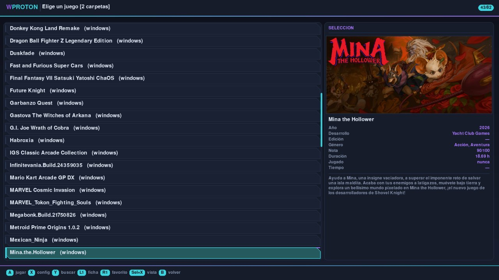
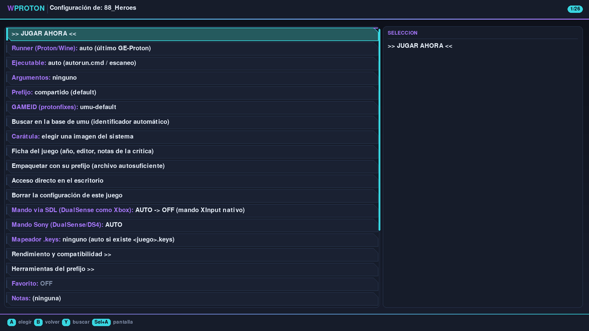
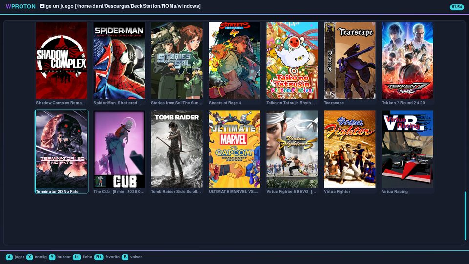
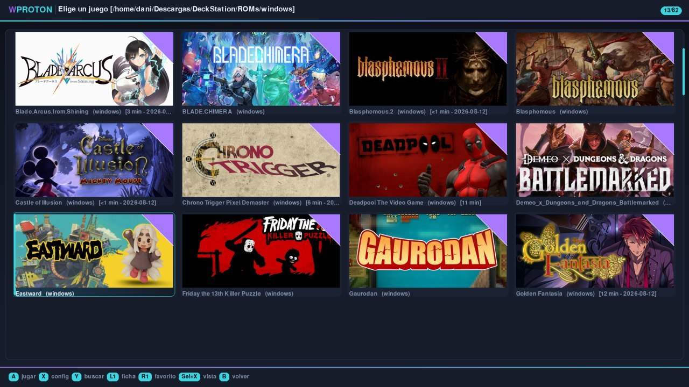

# Manual de uso de WProton

Guía práctica para empezar y para resolver los problemas más habituales.
Si solo quieres jugar, con los tres primeros apartados tienes de sobra.

---
## 1. Primeros pasos

### Antes de empezar

**Hace falta conexión a internet para instalar.** WProton se descarga a sí
mismo: su propio Python, los menús, umu-launcher, un GE-Proton y Proton
Frankenstein. Son unos cuantos cientos de megas, así que conviene hacerlo con
wifi y sin prisa.

**Para jugar no hace falta.** Una vez instalado, los juegos que ya tengas
funcionan sin conexión. Sí la necesitan cosas concretas: descargar más
runners, buscar carátulas, consultar la base de umu y traer las fichas de los
juegos.

### Instalar

Copia `wproton.sh` a una carpeta (por ejemplo `~/WProton`), dale permisos y ejecútalo:

```bash
chmod +x wproton.sh
./wproton.sh --setup
```

O más sencillo: **doble clic en `wproton.sh`** desde el explorador de archivos. Las dos formas hacen exactamente lo mismo; con doble clic te ahorras abrir la terminal.

`--setup` descarga todo eso **dentro de su carpeta**. No instala nada en el
sistema ni pide contraseña, y para desinstalarlo basta con borrar la carpeta.

La primera vez tarda unos minutos, según tu conexión. Si se corta a medias,
vuelve a lanzar `--setup`: continúa desde donde estaba. Después, arranca con:

```bash
./wproton.sh
```

Al abrirlo por primera vez te preguntará **dónde tienes los juegos**, con dos opciones: usar la carpeta `games/` de WProton, o buscar otra (se abre el navegador y la eliges con el mando). Se puede cambiar después en *Biblioteca y preferencias → Carpeta de juegos*.

Los menús se abren **a pantalla completa**. Si prefieres verlos en ventana, pulsa **Select + A** (o **F11**) y quedará recordado.

### Añadir tu primer juego

**Si ya tienes un juego empaquetado** (`.wsquashfs`, `.squashfs` o `.dwarfs`), no hay nada que preparar: **cópialo a tu carpeta de juegos —`games/` por defecto— y ya aparece en *Jugar***. También puedes abrirlo directamente desde el navegador de archivos o desde la línea de comandos:

```bash
./wproton.sh "Mi juego.wsquashfs"
```

Esos archivos son la forma en que WProton guarda los juegos: **un solo fichero comprimido** que se monta al vuelo, se juega en modo solo lectura y **guarda las partidas aparte**, sin modificarse nunca. Si te pasan uno hecho por otra persona, funciona igual.

**Si tienes otro formato**, WProton lo convierte por ti: menú principal → **Añadir un juego**, y se abre un navegador de archivos donde puedes elegir:

| Lo que tienes | Qué hace WProton |
|---|---|
| Un `.wsquashfs`, `.squashfs` o `.dwarfs` | Nada: se juega tal cual (basta con copiarlo a `games/`) |
| Un `.zip`, `.rar` o `.7z` | Lo descomprime y lo convierte en un archivo de juego |
| Un instalador de GOG (`setup_*.exe`) | Lo instala solo, sin ventanas, y lo empaqueta |
| Una carpeta con el juego ya instalado | Te deja probarlo y luego empaquetarlo |
| Un `.exe` suelto | Igual, tomando su carpeta como raíz |
| Un `.bat` o `.cmd` | Igual: algunos juegos arrancan con un script en vez de un ejecutable |

> Las carpetas que estén **dentro de tu carpeta de juegos** salen solas en la lista, sin tener que añadirlas: basta con que tengan un ejecutable, un `autorun.cmd`, un `drive_c` o que acaben en `.pc`.

> Empaquetar no es obligatorio: una carpeta o un `.exe` se pueden jugar tal cual, sin convertir nada. Empaquetar solo sirve para tenerlo todo en un fichero, que ocupa menos y es más cómodo de mover.

Cuando el juego esté en una carpeta, aparece este menú:

- **Probar el juego (sin empaquetar)** — lánzalo para ver si funciona.
- **Configurar** — cambia el Proton, el prefijo u otras opciones y vuelve a probar.
- **Empaquetar a wsquashfs** — cuando funcione, comprímelo en un solo archivo.

Puedes probar y ajustar tantas veces como quieras antes de empaquetar. **La configuración que hagas durante las pruebas se conserva** en el juego final.

### Prefijos que vienen de Batocera

Batocera **corre como root**, así que un prefijo hecho allí guarda los datos
del juego en `drive_c/users/root/`. En un PC normal, Proton usa `steamuser` y
Wine usa tu nombre: el juego mira ahí, no encuentra nada y arranca como recién
instalado (sin idioma, sin configuración).

WProton lo enlaza solo al preparar el prefijo. Si tu `steamuser` ya tiene
ficheros propios, no toca nada y avisa, para no mezclar partidas.

También puede pasar que la superposición **tape** carpetas: Wine borra y
rehace las de usuario, y a partir de ahí lo que trae el archivo deja de verse.
Las de usuario se destapan solas; para el resto hay *Gestión de archivos →
Reparar carpetas tapadas*.

### Jugar

Menú principal → **Jugar**. Ahí salen todos los juegos de tu carpeta de juegos, ya sean archivos empaquetados o carpetas. Elige uno con el mando y pulsa **A**.

> ¿Dónde está esa carpeta? La primera vez que abres WProton te pregunta dónde tienes los juegos. Si no eliges ninguna, usa `games/`, dentro de la propia carpeta de WProton. Puedes cambiarla cuando quieras en *Biblioteca y preferencias → Carpeta de juegos*.

La primera vez que lances un juego, un asistente te preguntará tres cosas: qué Proton usar, cuál es el ejecutable y unas opciones básicas. Si no sabes qué contestar, acepta lo que viene marcado: funciona en la mayoría de casos.

---

## 2. Manejo con el mando

| Botón | Qué hace |
|---|---|
| Cruceta o stick | Moverse |
| **Izquierda / derecha** | Saltar una pantalla entera (en la lista) |
| **A** | Elegir |
| **B** | Volver atrás un nivel |
| **Select** | Volver al menú principal desde donde estés (y ahí, salir) |
| **X** | Configurar el juego resaltado (en la lista de juegos) |
| **Y** | Buscar |
| **Select + A** | Pantalla completa / ventana |
| **Select + X** | Cambiar de vista: lista → vertical → panorámica → 4:3 |
| **X** sobre *Jugar al último* | Configurar ese juego sin abrir la lista |
| **Select** (5 s) | (con un juego abierto) Cerrarlo y volver al menú |
| **Select + Y** | (con un juego abierto) Recuperar el foco si se ha ido detrás |

Con bibliotecas grandes, **izquierda y derecha** saltan una pantalla completa en
vez de ir de uno en uno, y el puntero se queda en la misma fila para no perder
el hilo.

**Select** vuelve al menú principal esté donde esté, sin tener que ir dando
atrás con **B** menú por menú. Y estando ya en el principal, **cierra WProton**
(preguntando antes). Es una pulsación corta: mantenerlo sigue siendo lo que
cierra un juego.

**Buscar entre muchos juegos**: pulsa **Y** y aparece un teclado en pantalla; o, si tienes teclado, empieza a escribir directamente. Se filtran los juegos cuyo nombre *empiece* por lo que escribas.

Ese mismo teclado en pantalla se usa para escribir argumentos, notas o cualquier otro texto, así que no hace falta teclado físico para nada.

---



## 3. Ajustes de un juego

Desde la lista de juegos, ponte encima de uno y pulsa **X** (o entra en *Ajustes de un juego*).



Arriba está lo del día a día. Lo que casi nunca se toca vive en dos submenús: **Rendimiento y compatibilidad** (MangoHud, Fsync, DXVK, FSR, gamescope…) y **Herramientas del prefijo** (winecfg, winetricks, dgVoodoo2, OptiScaler).

Lo más útil:

**Ejecutable** — qué se lanza. **Lo que elijas aquí es lo que arranca**: si ese fichero no está, WProton avisa y no arranca ningún otro, porque jugar a algo distinto de lo que elegiste es peor que no jugar. Déjalo en «automático» si prefieres que decida él.

Si el juego arranca con un `.bat`, elígelo igual: WProton lo **lee** y hace lo que dice —abrir el ejecutable que menciona, con sus argumentos— en vez de ejecutarlo. Si el `.bat` instala algo (copia ficheros, toca el registro), eso se hace una sola vez y después se abre el juego directamente. Lo mismo con los lanzadores `.ahk` de AutoHotkey, habituales en los recopilatorios: se leen y se traducen a ajustes del perfil.

**Runner (Proton/Wine)** — con qué se ejecuta. Si un juego no arranca, esto es lo primero que conviene cambiar: prueba otro GE-Proton o una versión más antigua.

**Casos especiales** — lo que solo necesita algún juego raro. La fila resume lo que tengas puesto:

- **Unidades de Windows**: darle al juego una letra propia (`D:`, `E:`…), para los que buscan sus datos en una ruta corta.
- **El juego debe estar en `C:\`**: para los que miran `C:\<carpeta>\...` con la ruta escrita a fuego. La carpeta se enlaza dentro de `C:`, no se copia.
- **Ejecutable acompañante**: un programa que se abre antes del juego y se cierra con él.
- **Versión de Windows**: de 98 a 11. Algunos juegos viejos se niegan a arrancar en «Windows 10»; algunos modernos no arrancan en XP.
- **Escritorio virtual**: encierra el juego en una ventana con su propio escritorio, para los que cambian la resolución y dejan la pantalla rota.
- **OpenGL por Vulkan (Zink)**: para juegos OpenGL antiguos cuyos shaders el driver normal no consigue compilar.

Nada de esto añade ajustes nuevos al perfil: se guarda con los que ya había.

**Argumentos** — parámetros que necesita el juego, por ejemplo `-novr` o `-windowed`.

**Prefijo** — dónde se guarda la "instalación de Windows" del juego:
- *Compartido*: todos los juegos usan el mismo. Ocupa menos y va bien casi siempre.
- *Propio del juego*: uno exclusivo. Útil si un juego necesita librerías que estorban a otros.
- *Incluido en el archivo*: si el juego trae el suyo (estilo Batocera).

**Idioma del juego** — se elige de una lista y viene en **español** de fábrica.
Muchos juegos miran el idioma del sistema para decidir en cuál arrancan. Si
tu sistema no tiene ese idioma generado, WProton te avisa: Wine suele
apañarse igual, pero si el juego sigue saliendo en inglés esa es la razón más
probable.

**DLL overrides** — para los juegos que necesitan cargar una DLL propia en vez
de la de Wine: dgVoodoo2, ReShade, OptiScaler, cargadores de mods como BepInEx.
Ya no hace falta escribir la cadena a mano:

- *Elegir de una lista* — las cinco habituales (`dinput8`, `d3d9`, `dxgi`,
  `winhttp`, `winmm`) y las que ya tengas puestas, marcadas.
- *Buscar las DLL que hay en el juego* — mira junto al ejecutable. Si alguien
  dejó ahí un `dinput8.dll`, es porque quiere que se cargue.
- *Escribir a mano* y *Quitar todos*, que avisa de lo que se lleva por delante.

Lo que ya tuvieras puesto **nunca se pierde**: la lista muestra la unión de lo
tuyo y lo que se ofrece, con tus valores intactos.

> ¿Se está aplicando de verdad? Pon `DIAG_DLL=1` en `settings.conf`, juega un
> minuto y mira el registro: dirá si cada DLL se cargó la nativa o la de Wine.
> Déjalo apagado el resto del tiempo, que habla muchísimo.

**HDR** — en *Rendimiento y compatibilidad*. Pone las variables que hacen falta
y se lo pide a gamescope. La propia fila del menú te dice si va a poder verse:
si no hay gamescope ni sesión Wayland, no hay HDR por mucho que lo enciendas.
El monitor también tiene que serlo, y el juego traerlo.

**Mando vía SDL** — en automático. Se activa solo con mandos que lo necesitan (DualSense, DualShock, mandos de Nintendo) y se queda apagado con mandos XInput como los de la Steam Deck o la Legion Go.

**Buscar en la base de umu** — consulta la base de datos de
[umu](https://github.com/Open-Wine-Components/umu-database) y, si encuentra el
juego, pone el identificador que necesita protonfixes para aplicarle sus
arreglos. Al añadir un juego nuevo lo propone solo.

**Carátula** — hay tres formas: descargarlas todas de golpe desde *Carátulas y
perfiles*, **buscar la de ese juego por nombre** (si el fichero se llama de
forma rara y la búsqueda automática falla), o elegir una imagen de tu disco. Hay
dos, y cada una vive en su carpeta con el nombre del juego:

| Carpeta | Para qué |
|---|---|
| `covers/` | Vertical (2:3), para la lista y la rejilla clásica |
| `covers_wide/` | Panorámica, tipo cabecera de Steam |
| `covers_43/` | Cuadrada 4:3 (640x480) |
| `metadata/` | Ficha del juego y duración (no son imágenes) |

Cada vista usa su carpeta, y en la vista de lista puedes elegir cuál se
enseña en el panel (*Biblioteca y preferencias → Carátula en la vista de
lista*). Si un juego no tiene la de esa forma, se usa la vertical. Las
imágenes nunca se deforman: se centran en su casilla.

Si ya tienes una colección de carátulas, cópiala en la carpeta que
corresponda: los ficheros se llaman igual que el juego, con espacios o con
guiones bajos — las dos formas valen.

> Para las descargas de SteamGridDB hace falta una clave gratuita
> (steamgriddb.com → Profile → Preferences → API). En vez de teclearla con el
> mando, puedes pegarla en un fichero de texto y dejarlo junto a `wproton.sh`:
> WProton la recoge, la guarda a buen recaudo y borra el fichero.

**Descargar datos de los juegos** (en *Biblioteca y preferencias*) hace lo
mismo con la información: baja de una vez la **ficha de Steam** (año, género,
nota, descripción) y la **duración de HowLongToBeat** de todos los juegos que
no la tengan. Antes solo se conseguían de uno en uno, entrando en la ficha de
cada juego.

El panel de la derecha enseña la carátula, la ficha y la sinopsis:


### La nota, y los juegos que no están en Steam

La **nota** que trae Steam es la de Metacritic, y solo la incluye si el juego
la tiene en su ficha: los juegos viejos casi nunca. Y un juego que no esté en
Steam se queda sin ficha ninguna.

Para esos dos casos se puede poner una **clave de RAWG** (*Biblioteca y
preferencias → Clave de RAWG*). Es gratuita y **opcional**: sin ella todo
funciona igual, solo con los datos de Steam.

RAWG es siempre la fuente **secundaria**: se consulta después de Steam y solo
rellena lo que falte, porque la ficha de Steam trae la sinopsis en español y
datos más completos. Cada fuente guarda su propio fichero, así que se sabe
siempre de dónde vino cada dato.

> Metacritic no tiene API propia. Lo que se anuncia como tal son raspadores de
> su web (que se rompen cuando cambian la página) o servicios de pago. RAWG
> publica esa nota en su API, que es estable y legal. Los datos son suyos y
> hay que citarlos como fuente.

Se puede pedir solo una de las dos. No se vuelve a descargar lo que ya está,
así que se puede repetir cuando añadas juegos nuevos. Los que no aparezcan
suelen tener el nombre del archivo muy distinto al del juego: se arregla
renombrando el `.wsquashfs`.

**Importar un fichero `.reg`** (en *Herramientas del prefijo*) — mete claves en
el registro del prefijo. El uso más común es cambiar el idioma de un juego que
lo guarda ahí y no en un menú. Antes de aplicarlo te enseña qué lleva dentro, y
**guarda una copia del registro** en `wp_registro_<fecha>/` dentro del prefijo,
porque una vez importado no hay deshacer.

> **Runners y herramientas** tenía diecinueve filas y mezclaba lo que se usa a
> diario con lo que se instala una vez. Lo segundo está ahora en *Instalar y
> actualizar componentes >>*: umu-launcher, Python portable, evdev, los
> extractores de GOG, las herramientas FUSE y DwarFS, y los datos de
> HowLongToBeat.
>
> *Instalar librerías de Windows* se queda fuera: eso no instala un componente
> de WProton, mete `vcredist` y compañía en el prefijo de un juego, se hace por
> juego y se repite. También se llega desde *Ajustes del juego*, pero desde
> aquí puedes elegir el prefijo, que es lo que hace falta cuando es compartido.

**Elegir versión de GE-Proton** — en *Runners y herramientas → Descargar
runners → GE-Proton*.

GE-Proton lleva cientos de versiones publicadas, y pedirlas todas eran tres
consultas a GitHub cada vez que entrabas. Al entrar salen ahora **las series**:

```
Serie 11.x
Serie 10.x
Serie 9.x
Serie 8.x
Serie 7.x
Serie 6.x
```

y al elegir una **se cargan solo las suyas**, enteras. Para las series nuevas es
una consulta en vez de tres, y la lista que sale es corta.

La lista de series se construye sola con lo que haya publicado, así que el día
que salga la 12 aparece sin tocar nada.

Lo consultado se guarda unas horas, así que entrar por segunda vez es
instantáneo. Si GitHub no responde, se usa lo guardado y se avisa en el
registro: una lista de hace un rato deja elegir, una lista vacía te deja sin
poder bajar nada.

**Elegir versión de Wine de Kron4ek** — mismo sitio, entrada *Wine Kron4ek*.

Tres pasos, y cada lista es corta:

1. **La serie**: 11.x, 10.x, 9.x… igual que en GE-Proton.
2. **La variante**, dentro de esa serie. Las filas van solo con el nombre y la
   explicación arriba, en la cabecera: el menú usa una fuente proporcional, así
   que rellenar con espacios no alinea nada y se veía el escalón.

   | Variante | Qué es |
   |---|---|
   | `wow64` | Vanilla, **no necesita librerías de 32 bits**. La que quieres en SteamOS |
   | `staging-tkg-wow64` | Staging más los parches de wine-tkg |
   | `staging-wow64` | Staging |
   | `amd64`, `staging-amd64`, `staging-tkg-amd64` | Lo mismo, pero necesitan multilib |
   | `x86`, `staging-x86`, `staging-tkg-x86` | Solo para sistemas de 32 bits |
   | `Wine Proton` | El de Valve. Son publicaciones aparte, con su propia numeración |

3. **La versión** concreta, y el paquete se localiza solo.

Antes había que elegir entre las 12 últimas versiones y luego leerse los doce
nombres de fichero de la publicación (`wine-11.13-staging-tkg-amd64-wow64.tar.xz`)
para dar con el que querías. Y de la serie 9 o la 8 no había forma de bajar
nada. Si una versión antigua no trae la variante que has pedido, se te dice y
se te enseña lo que sí trae, en vez de instalarte otra.

**Tener los tres al día** — *Runners y herramientas → Actualizar a la última
versión >>*. Cada fila dice qué versión tienes ya instalada:

```
GE-Proton    (el runner por defecto)   [GE-Proton11-6]
Wine         (Kron4ek staging wow64)   [wine-11.13-staging-amd64-wow64]
UMU-Proton   (Open Wine Components)    [no instalado]
```

Solo se descarga si hay una más nueva que la que tienes.

Del Wine se coge `staging-amd64-wow64` a propósito: staging trae más arreglos
que el vanilla, y wow64 **no necesita librerías de 32 bits**, que es justo lo
que no se puede instalar en una SteamOS inmutable. Si quieres otra variante,
están todas en *Descargar runners → Wine Kron4ek*.

### Juegos de Linux sueltos (.sh y .AppImage)

Un `.sh` o un `.AppImage` dejado **en la raíz de la carpeta de juegos** aparece
en la biblioteca como cualquier otro juego, sin empaquetar ni nada.

Solo se miran en el **primer nivel**, a propósito: casi todos los juegos traen
sus propios `.sh` por dentro (`start.sh`, `setup.sh`, el lanzador de una carpeta
que ya sale como juego). Si se buscaran en profundidad, un solo juego llenaría
la lista de entradas que no son juegos. En la raíz, en cambio, lo que hay
puesto lo has puesto tú a propósito.

### Manejar los menús con el ratón

Además del mando y el teclado, los menús responden al ratón:

| Acción | Qué hace |
|---|---|
| Mover el puntero | Selecciona la fila que hay debajo |
| Clic izquierdo | Entra en esa fila (como A o Intro) |
| Clic derecho | En la lista de juegos, abre los **ajustes de ese juego**; en el resto, vuelve atrás |
| Rueda | Sube y baja **media pantalla** por golpe |

El clic derecho selecciona antes la fila que hay debajo: abrir los ajustes de un
juego que no es el que señalas sería peor que no hacer nada.

La rueda mueve media pantalla porque con tres filas por golpe una lista de
cincuenta juegos son diecisiete vueltas, y entonces no compensa frente a la
búsqueda.

**El puntero se esconde solo** tras unos segundos quieto y vuelve al primer
movimiento: en una Deck sin ratón un puntero plantado en medio sobra, y con
ratón verlo encima del menú mientras juegas con el mando también.

Pasar el puntero por el **panel lateral** —la ficha del juego, la carátula— no
cambia la selección; solo cuenta la zona de la lista.

Se apaga con `RATON_MENUS=0` en `settings.conf`.

> Por dentro, el ratón **no reescribe la navegación**: mueve la selección e
> inyecta la misma tecla que pulsarías tú. Así no puede desincronizarse del
> mando, y cualquier arreglo en la selección vale para los tres a la vez.

### Juegos de Linux dentro de un `.wsquashfs`

Un `.sh` o un `.AppImage` empaquetado dentro de un `.wsquashfs` se detecta y se
lanza como juego de Linux, sin Wine de por medio.

> **El AppImage no necesita venir con permiso de ejecución.** Antes se buscaba
> «cualquier ejecutable ELF», y un AppImage lo es… pero solo si tiene el bit de
> ejecución puesto, y recién descargado no suele tenerlo. Squashfs conserva los
> permisos tal cual estaban al empaquetar, así que dentro del archivo seguía sin
> tenerlo y el juego no aparecía. Ahora se busca por extensión y el permiso se
> arregla al lanzar, aprovechando la capa de escritura del montaje.
>
> Si aun así no se puede poner (un archivo de solo lectura de verdad), se dice
> claramente en vez de intentar `bash` sobre un binario, que es lo que hacía una
> de las ramas y solo escupía basura.

### Un juego puede traer su propia carpeta personal (`.home`)

WProton busca una carpeta personal dentro del juego, **en este orden**:

| Se busca | Ejemplo |
|---|---|
| `<lanzador>.home` junto al ejecutable | `Xemu.AppImage.home` |
| `<lanzador sin extensión>.home` | `Xemu.home` |
| **Cualquier `*.home` que haya al lado** | el `.sh` se llama distinto que el AppImage |
| `.home` en la raíz del juego | `.home` |
| Si no hay ninguna, la de siempre | `prefixes/<juego>.home` |

La tercera regla es la que resuelve el caso real: el lanzador que se detecta
suele ser un `.sh` que por dentro llama a otra cosa con parámetros —
`Crazy Taxi 3 High Roller.sh` ejecutando `Xemu.AppImage -dvd_path …`— y la
carpeta personal lleva el nombre **del AppImage**, no el del `.sh`.

Si hay **varias** `*.home`, se prefiere la que tenga su fichero al lado
(`Xemu.AppImage.home` con `Xemu.AppImage` presente). Si aún así queda más de
una, no se adivina: se anota en el registro y se usa la carpeta de siempre.
Elegir a boleo dónde va a guardar el juego sus partidas es la clase de acierto
que sale caro.

Las dos primeras son el **convenio de AppImage**: un AppImage busca por su cuenta
una carpeta llamada igual que él con `.home` detrás, y la usa como carpeta
personal. Si el paquete la trae, dentro está el juego ya configurado.

> **Solo cuentan las que acaban en `.home`.** Al lado del lanzador hay muchas
> otras carpetas —`Super Mario Remastered_Data` de Unity, `lib`, `share`— y
> ninguna es una carpeta personal. Aceptar cualquier carpeta con el nombre del
> juego sería meter al juego a escribir dentro de sus propios datos. Sirve
para empaquetar un juego **ya configurado**: ajustes hechos, mandos mapeados,
resolución puesta, y arranca bien a la primera.

Manda sobre todo lo demás: si está ahí, es que quien empaquetó el juego la puso
a propósito, y crear otra al lado sería tirar ese trabajo. En el registro se
distingue cuál se está usando:

```
[+] Carpeta del juego: /…/tmp_mount/MiJuego/.home
    La trae el propio juego (.home): se usa esa, con lo que
    venga configurado, en vez de crear una vacia.
```

Funciona aunque el `.wsquashfs` sea de solo lectura: el juego se monta con una
capa de escritura encima, así que lo que escriba en su `.home` se conserva en
`overlays/<juego>/upper`.

Vale tanto para juegos de Linux (`.sh`, `.AppImage`) como para los de Windows.

### Borrar la caché de shaders de un juego

*Ajustes del juego → Rendimiento y compatibilidad → **Borrar la caché de shaders
de este juego***.

La caché de DXVK se va llenando mientras juegas y hace que los tirones del
principio desaparezcan. Pero si se corrompe —un cierre brusco, un cambio de
runner, un driver nuevo— el juego puede petar al arrancar, quedarse en negro o
dar tirones que no se van. Borrarla obliga a regenerarla desde cero.

Borra solo la de **ese** juego (`<ejecutable>.dxvk-cache` y su equivalente de
VKD3D), porque WProton junta todas las cachés en `cache/dxvk` y `cache/vkd3d` en
vez de dejarlas sueltas por los prefijos. Después ofrece borrar también la del
**driver (Mesa)**, que no se puede separar por juego: o entera o nada, y afecta
a todos.

> **Es una acción, no un interruptor, y es a propósito.** En Batocera
> (`dxvk_reset_cache`) es un ajuste que se queda puesto. Un ajuste permanente
> borraría la caché **en cada arranque**, con lo que el juego no llegaría a
> tener caché nunca y tendrías tirones para siempre sin saber por qué. Se hace
> una vez, que es cuando sirve.

### Fondos de temporada

El fondo que se ve entre menús cambia solo en unas fechas:

| Tema | Cuándo | Fondo y partículas | La palabra WPROTON |
|---|---|---|---|
| Halloween | 25–31 de octubre | Morado oscuro, brasas naranjas subiendo | W morada, PROTON naranja calabaza |
| Navidad | 20–26 de diciembre | Azul noche, nieve cayendo | W roja (Papá Noel), PROTON blanco nieve |
| Fin de año | 30 dic – 2 ene | Chispas doradas subiendo | W dorada, PROTON blanco |
| Reyes | 5–6 de enero | Destellos dorados cayendo | W dorada, PROTON violeta |

La marca del centro se tiñe también: con el fondo cambiado y las letras en su
morado y cian de siempre, la pantalla queda a medias. Se respeta la forma —la W
distinta del resto— y solo cambian los colores.

El resto del año, el fondo de siempre: una decoración puesta todo el año
dejaría de ser una gracia. Se apaga con `TEMAS_TEMPORADA=0` en `settings.conf`.

> **Si tienes tu propio fondo, manda el tuyo.** Solo se le añaden las partículas
> encima; tu imagen no se pisa por una fiesta.
>
> No se descarga ni se empaqueta ninguna imagen: es todo dibujado. Meter fotos
> de calabazas y de nieve en el script serían megas para cuatro días al año.

El calendario está en una sola función (`tema_temporada`), así que cambiar
fechas o añadir una fiesta se hace en un sitio.

**Para verlos sin esperar a la fecha:** con `DEV_MODE=1` en `settings.conf`,
*Modo desarrollo → Probar un fondo de temporada*. Se rearrancan los menús y el
siguiente ya sale con el fondo elegido; «como toque por fecha» vuelve a lo
normal. El forzado dura hasta que cierres WProton.


### Cómo está organizado el menú del juego

Tres agrupaciones nuevas en 1.75, porque la pantalla se había convertido en un
cajón de sastre:

| Submenú | Qué hay dentro |
|---|---|
| **Mandos >>** | SDL/hidraw, puente Steam Input → XInput, mando Sony, **mando virtual**, escribir SDL en el registro del prefijo |
| **Protonfixes / UMU >>** | El `GAMEID` y la búsqueda en la base de umu |
| **Carátula y ficha >>** | Las dos carátulas, la ficha del juego, las notas y las estadísticas |
| **Archivo y mantenimiento >>** | Reinstalar el `.bat` del juego, copias de partidas, comprobar el archivo, acceso directo, repetir el asistente, borrar saves del overlay y borrar la configuración |
| *Mapeador .keys* | Se queda **fuera**: convertir el mando en pulsaciones de teclado es otra cosa distinta de elegir cómo se lee el mando |

*Favorito* y *Completado* se quedan fuera de ese submenú a propósito: son
interruptores de una pulsación que se usan a menudo y ahí costarían tres.

Y las dos de empaquetar —*EMPAQUETAR A WSQUASHFS* y *Empaquetar con su prefijo*—
se quedan en el menú principal y **juntas**: son el paso final de preparar un
juego, se usan bastante, y esconderlas detrás de «mantenimiento» sería
enterrarlas.

> *EMPAQUETAR A WSQUASHFS* solo aparece si el juego está **en carpeta**. Si ya
> es un `.wsquashfs`, no hay nada que convertir y la fila no sale.

Dos cosas cambiaron de sitio por estar donde nadie las buscaría:

- El **mando virtual** vivía dentro del *Mapeador .keys*. Tenía sentido cuando
  solo se usaba junto a un fichero de teclas, pero ya no lo necesita.
- *Volver a instalar lo que trae el juego (.bat)* también estaba ahí, y no tiene
  ninguna relación con las teclas: vuelve a ejecutar el `.bat` de instalación
  del juego. Está en *Archivo y mantenimiento*, que es donde encaja por lo poco
  que se usa.

### Que un juego use siempre el más nuevo

Al elegir el runner de un juego, antes de la lista de versiones concretas hay
tres opciones:

| Opción | Qué hace |
|---|---|
| *(automático: último GE-Proton instalado)* | Lo de siempre, y el valor por defecto |
| *(siempre el último Wine instalado)* | El Kron4ek más nuevo que tengas |
| *(siempre el último UMU-Proton instalado)* | El UMU más nuevo que tengas |

Elegir una **versión concreta** ata el perfil a ella: en tres meses estará vieja
y hay que volver a entrar juego por juego. Con estas tres, al bajar una versión
nueva los juegos la cogen solos.

Si eliges una familia que no tienes instalada, WProton te lo dice en ese momento
—no al lanzar— y el juego se lanzará con el último GE-Proton hasta que bajes
uno. Quedarse sin jugar por eso sería peor.

### Pasar partidas entre dos equipos de la misma red

Sin instalar nada. En *Ajustes del juego → Archivo y mantenimiento → Partidas
guardadas → Sincronizar*:

1. En el equipo que **tiene** las partidas: *Compartir mis copias con otro
   equipo*. Sale su IP, el puerto y un **código de seis cifras**.
2. En el otro: *Traer copias de otro equipo*, y escribe esos tres datos.

Se trae lo que aquí no está y lo que allí es **más nuevo**. Lo que aquí es más
nuevo **no se toca**, y se dice cuáles son.

> **Por qué no es sincronización automática, y no va a serlo.** Un
> sincronizador genérico resuelve los choques guardando los dos ficheros con
> nombres distintos. Para un documento vale; para una partida no sirve de nada,
> porque el juego lee uno solo y tú no sabes cuál es el bueno. El caso malo
> llega solo: juegas en un equipo sin red, luego en el otro, y al reencontrarse
> uno pisa al otro en silencio. Con una dirección explícita eso no puede pasar.

Los tres campos que se escriben —IP, puerto y código— salen con un **teclado
numérico** de doce teclas en vez de la rejilla completa de cuarenta: con el
mando, cada cifra está a un paso.

El puerto es 8788 por defecto y se cambia en *Puerto para la red local*. Tiene
que ser **el mismo en los dos equipos**.

**Para no escribir nada la próxima vez.** La primera vez que traigas copias de
un equipo y funcione, se te ofrece guardarlo con un nombre («Deck»,
«Sobremesa»). A partir de ahí, *Traer copias* sale con la lista y no pide ni IP
ni código.

Para que eso funcione, el equipo que comparte debe usar un **código fijo**:
*Código al compartir* → fijo. De serie sale uno nuevo cada vez, que es más
seguro pero obliga a teclearlo siempre. Lo que se quita es escribirlo, no la
puerta: sigue haciendo falta un código.

> El equipo se ofrece guardar **después** de que la descarga haya funcionado, no
> antes. Guardar una IP o un código equivocados solo serviría para volver a
> fallar mañana sin saber por qué.

### Un servidor de partidas siempre disponible

En vez de que las dos máquinas coincidan encendidas, una guarda las copias de
todas. *Partidas guardadas → Sincronizar → **Servidor de partidas***.

**En el equipo que más tiempo esté encendido:** *Instalar el servidor AQUÍ*. Se
queda en marcha con la máquina, sin necesidad de abrir WProton, y te da su IP y
un **token**.

**En los demás:** *Usar un servidor*, con esa IP y ese token. Luego *Subir mis
copias al servidor* deja allí lo que tengas, y *Traer copias* se las lleva.

| Detalle | Cómo está resuelto |
|---|---|
| Permisos | Servicio **de usuario**, sin root. Se quita borrando un fichero |
| Con la sesión cerrada | Se activa *lingering*, o el servicio moriría al salir justo cuando más falta hace |
| Subir algo más viejo | **Se rechaza**: el servidor conserva la copia nueva y te lo dice |
| Una partida que se corrompió | Guarda las **5 últimas versiones** de cada juego en `backups/versiones/` |
| Quién puede escribir | Token largo generado solo, no un código de seis cifras: un servidor que acepta subidas necesita más puerta que uno que solo presta |

> El servidor de *Compartir mis copias* (el de un rato) **no acepta subidas**, y
> está comprobado que las rechaza. Son dos cosas distintas a propósito.

**Funciona en cualquier equipo con Python 3**, que es algo que WProton ya
necesita: no hay dependencias nuevas, todo es biblioteca estándar. *Instalar el
servidor aquí* necesita además systemd (CachyOS, SteamOS y las distribuciones
normales lo tienen; Batocera no, y ahí te avisa y queda el modo manual).

**Y es opcional del todo:** no arranca nada por su cuenta y los ajustes están
vacíos de serie.

> **Lo que más guerra da es el cortafuegos.** El servicio arranca, responde en
> el propio equipo, y desde el otro no hay manera. WProton lo comprueba solo al
> instalar —probando por su **IP de red**, no por `127.0.0.1`, que respondería
> aunque el puerto estuviera cerrado a todo el mundo— y te dice la orden exacta
> para `firewalld` o `ufw`.

Detalles que conviene saber:Detalles que conviene saber:

- **Se comparte solo mientras esa ventana esté abierta.** No queda ningún
  servicio en segundo plano.
- Hace falta el **código**, que cambia cada vez. Sin él no se lista ni se
  descarga nada.
- Se sirve **solo la carpeta de copias**, y solo ficheros `.zip` de dentro: los
  nombres se limpian, así que no se puede pedir nada de fuera.
- Cada copia que llega se **comprueba con su huella SHA-256** antes de darla por
  buena. Una copia de partidas a medias es peor que no tenerla, porque parece
  buena hasta que la restauras.

**Proton oficial de Steam** — en *Runners y herramientas → Descargar runners*.

Valve **no publica Proton para descargar por su cuenta**: solo se consigue a
través de Steam. Así que WProton no lo descarga: busca los que Steam ya tiene
instalados —incluidos los de la tarjeta o de otro disco— y los enlaza.

No ocupa nada, porque es un enlace a la copia de Steam, y se actualiza cuando
Steam lo actualice. Si algún día desinstalas ese Proton desde Steam, el enlace
se queda apuntando a la nada: basta con volver y elegir otro.

> Si no aparece ninguno, instálalo desde Steam: *Biblioteca → Herramientas →
> Proton*.

**Instalar librerías** — los redistribuibles de Windows. Está en la pantalla
de ajustes del juego y también en *Herramientas del prefijo*: desde ahí va
directo al prefijo de ese juego, sin tener que volver a elegirlo. (En el menú
principal sigue estando, para cuando quieras tocar otro prefijo.)

La fila dice a qué prefijo va a instalar, y si es el **compartido** pide
confirmación: lo que metas ahí lo verán todos los juegos en ese modo.

Primero se elige la categoría, para no tener que buscar entre cuarenta entradas:

- *Visual C++ y .NET* — lo que piden casi todos
- *DirectX y shaders*
- *Códecs de vídeo y sonido*
- *Otros* — fuentes, PhysX, XNA, Unreal
- *Verlo todo en una sola lista*

La de **códecs** es la que suele faltar cuando un juego arranca pero **las
cinemáticas salen en negro o sin sonido**.

| Si el juego... | Prueba con |
|---|---|
| No reproduce ningún vídeo | `quartz`, o el pack `directshow` |
| Es de los 2000 y pide Media Player | `wmp11` (o `wmp10`/`wmp9` si es más viejo) |
| Tiene intros de los 90 | `icodecs`, `cinepak` |
| Vídeo sin sonido | `l3codecx` |
| Cinemáticas `.wmv` | `wmv9vcm` |
| Nada de lo anterior funciona | `lavfilters`, o el pack `allcodecs` |

> De los tres Windows Media Player, **marca solo uno**: se pisan entre ellos.
> Si marcas varios, WProton se queda con el más nuevo.

Se puede elegir en qué prefijo van: el compartido, el de un juego concreto, o cualquiera de los que
tengas. Se instalan de uno en uno y la barra avanza de verdad; si alguno falla,
sigue con el resto y al final dice cuál falló.

**Empaquetar con su prefijo** — crea un archivo **autosuficiente**: lleva dentro
el juego y su prefijo, así que se copia a otro equipo y funciona sin instalar
nada. Necesita que el juego use un prefijo propio (no el compartido) y que lo
hayas probado antes. El original no se toca.

**Notas** — un recordatorio tuyo: *"necesita -novr"*, *"con GE 9-27 va mejor"*.

**Borrar la configuración de este juego** — quita sus ajustes y empieza de
cero. El juego y las partidas no se tocan, y queda una copia `.bak` por si
acaso. También están todos juntos en *Perfiles guardados*.

**Acceso directo en el escritorio** — crea un icono que lanza ese juego
directamente, con su carátula. Útil para los que juegas a menudo.

**Favorito** — lo pone al principio de la lista, con una cinta en la carátula.

**Partidas guardadas** — copias de seguridad (ver apartado 5).

---

## 4. Si un juego no arranca

Prueba en este orden:

1. **Otro runner.** Muchos fallos se arreglan con un GE-Proton distinto. Los juegos antiguos suelen ir mejor con versiones antiguas (por ejemplo GE-Proton 9-27).
2. **Instalar librerías.** *Runners y herramientas → Instalar librerías de Windows*. Marca `vcrun2022`; si el juego es de Unreal, también el pack de prerrequisitos; PhysX si lo pide.
3. **Argumentos.** Algunos juegos necesitan `-novr` u otros parámetros para no arrancar en un modo que no tienes.
4. **Prefijo propio.** Si sospechas que otro juego le ha ensuciado el prefijo compartido. Con una excepción: si el juego trae **su propio prefijo** (los de Batocera), no lo cambies — trae el registro y las DLL que necesita.
5. **Mirar el registro.** *Ver el registro de la última sesión*: las últimas líneas suelen decir qué falta (una DLL, una librería…).

### WProton te dice qué hacer

Cuando un juego falla, WProton lee el final del registro y, si reconoce el
fallo, **dice qué hacer y dónde**, en vez de enseñarte un código. Cada caso que
reconoce es uno que ya le pasó a alguien:

| Lo que ves | Lo que es |
|---|---|
| `rc=53` y nada más | El juego es de .NET y Mono está apagado |
| «No encuentro los efectos» (ReShade) | Falta `d3dcompiler_47` |
| Un error genérico al arrancar | Falta un `d3dx9_XX` concreto, o un Visual C++ de una versión concreta |
| `rc=1` a los pocos segundos | El prefijo es de 32 bits y el runner no lo admite |
| El juego se sale solo al rato | Se acabó la memoria de 32 bits, o los shaders no compilan |
| Se cierra limpio en segundos | El lanzador arrancó y el juego reventó |

También avisa cuando el registro **repite la misma línea miles de veces**,
aunque la partida haya durado minutos: eso siempre significa que algo va mal.

Y si **no** reconoce el fallo, no se inventa nada.

Si un juego se cierra en menos de diez segundos, WProton te enseña automáticamente el final del registro.

### El mando va en los menús pero no en el juego

Es lo más frecuente en el modo Juego de SteamOS, y no es un fallo del juego.

Steam esconde el mando físico a lo que lanza —con
`SDL_GAMECONTROLLER_IGNORE_DEVICES`, una lista de casi 800 fabricante/modelo— y
ofrece a cambio su mando virtual, un «Microsoft X-Box 360 pad». El problema es
que **ese mando virtual está también dentro de la lista**, así que el juego
recibe la orden de ignorar el único mando que tiene. Los menús de WProton sí lo
ven porque leen `/dev/input` en crudo, y eso hace que parezca cosa del juego.

WProton lo detecta y lo dice en el registro:

```
mando 1: "Microsoft X-Box 360 pad 0"  [045e:028e] <-- STEAM LE DICE AL JUEGO QUE LO IGNORE
[!] TODOS LOS MANDOS QUE HAY ESTAN EN LA LISTA DE IGNORADOS DE STEAM.
```

**La solución** es *Ajustes del juego → Rendimiento y compatibilidad → Arreglo
mando SteamOS (Steam Input)*: quita esas cuatro variables para ese juego, y así
ve el mando virtual con normalidad.

Va por juego y no de serie porque no siempre conviene: si `/dev/hidraw` no se
puede leer, el mando virtual de Steam es el único que funciona, y es justo esa
lista la que hace que el juego lo use.

### Si con eso tampoco va: hacen falta las dos cosas

Hay un segundo motivo, independiente del primero, y por eso quitar la lista de
ignorados a veces no basta. El mando virtual de Steam Input es un dispositivo
**uinput**: aparece en `/dev/input` pero **no tiene nodo `/dev/hidraw`**. Y
GE-Proton 11-4 y siguientes leen los mandos precisamente por hidraw, así que ahí
no encuentran nada. No es que lo ignoren: es que no lo ven.

WProton también lo detecta:

```
[!] EL UNICO MANDO QUE HAY ES VIRTUAL (uinput), sin nodo /dev/hidraw.
    Este runner lee los mandos por hidraw, asi que no lo encontrara.
```

### Cuando Steam se queda el mando: el mando virtual de WProton

Es la vía que **no necesita reiniciar Steam**, y la recomendada.

Steam Input se queda el mando físico y ofrece el suyo, que es uinput y que hay
juegos que no ven. WProton **captura el de Steam y le ofrece al juego un Xbox
360 corriente**, creado por él. El juego ve un mando normal y no hay que tocar
nada de Steam.

**Se elige a mano, en el juego que lo necesite**: *Ajustes del juego → Mapeador
.keys → Mando virtual → «Mando Xbox (probar esto primero)»*.

Y no es automático a propósito. En el modo Juego de la Deck, Steam Input esconde
el mando físico **en todos los juegos**, así que un automático basado en «el
único mando es el virtual de Steam» se activaría en la biblioteca entera para
arreglar uno. Y capturar el mando no es gratis: queda cogido en exclusiva, se
pierden la vibración, el giroscopio y el remapeado de Steam Input, y hay un
salto más de latencia. Eso se paga donde hace falta, no en todas partes.

En el registro se ve qué hizo, siempre:

```
[+] Mando virtual activado (xbox)
Mando virtual: apagado para este juego (MANDO_VIRTUAL=0)
```

> Hasta la 1.75 esta opción **no funcionaba en la mayoría de juegos**: la
> llamada que crea el mando virtual estaba dentro del bloque que busca el
> fichero `.keys`, así que solo se creaba en los juegos que tuvieran uno.
> Elegías «Mando Xbox», se guardaba en el perfil, y no pasaba nada — sin ningún
> aviso. El comentario del propio código decía que iba aparte del mapeador:
> estaba bien escrito y mal colocado.

Select 5 segundos sigue funcionando: el guardia de salida reescanea los
dispositivos cada 3 segundos y coge el nuestro.

### Si aun así no va

Queda desactivar Steam Input para el atajo de WProton **desde Steam**: en el
menú de Steam, sobre WProton, *Mando → plantilla «Desactivar Steam Input»*. Son
dos pulsaciones y hay que reiniciar Steam para que lo lea.

> WProton llegó a hacer esto solo, editando el `localconfig.vdf` de Steam,
> reiniciándolo y volviendo al juego. Funcionaba, pero eran tres piezas
> frágiles para algo que se hace en dos pulsaciones, y una fila más en los
> ajustes del juego pegada a otra parecida. Se quitó en favor del mando
> virtual.

### El caso del modo Juego: Steam se queda tu mando

En el modo Juego, Steam se queda el mando físico y solo ofrece el suyo, que es
virtual. Aquí **preferir SDL es lo peor que se puede hacer**:
`PROTON_PREFER_SDL` apaga Steam Input en winebus, y si el único mando que hay es
el de Steam Input, apagarlo quita el único mando que existe.

Lo que sirve es el puente que GE-Proton 11-4 añadió para esto:
`PROTON_STEAMINPUT_XINPUT_FALLBACK`, un dispositivo Steam Input que reenvía las
asignaciones de XInput. En *Ajustes del juego → Rendimiento y compatibilidad →
**Puente Steam Input → XInput***.

En **automático** se enciende solo cuando el único mando que hay es el virtual
**de Valve** (`0x28de`) — no con cualquier mando virtual, porque el nuestro
también lo es y para ése la respuesta es otra.

Las dos opciones son incompatibles y WProton no las pone juntas: si estás
prefiriendo SDL, el puente no se pone y se dice en el registro.

**El otro ajuste, para cuando el mando físico sí llega:** *Ajustes del juego →
Rendimiento y compatibilidad → **Desactivar Steam Input para este juego***.

Pone `PROTON_PREFER_SDL`, y GE-Proton **apaga Steam Input y hidraw** cuando esa
variable está presente, dentro de ese Proton y solo ahí. Por eso vale para tres
juegos y no para el resto, y funciona desde el modo Juego sin cerrar Steam.

> No confundir con el «Steam Input por juego» de Steam: Steam guarda eso **por
> aplicación**, y para Steam la aplicación es WProton entero. Editarlo exige
> además tener Steam cerrado, así que desde el modo Juego no se puede. Por eso
> no se hace por ahí.

**Desde 1.75 WProton lo resuelve solo.** Si el único mando que hay es virtual y
el runner lee por hidraw, pone `PROTON_USE_SDL` sin preguntar y lo dice:

```
[+] Mando por SDL, automatico: el unico mando que hay es virtual
    (el de Steam Input) y no tiene nodo /dev/hidraw, que es por
    donde lo buscaria GE-Proton11-6-x86_64. Con SDL si lo ve.
```

Si quieres lo contrario, *Que Wine lea el mando por SDL* → **Nunca**.

> **Cuidado con dos ajustes que se llamaban casi igual.** Había *Mando vía SDL*
> en Rendimiento y compatibilidad y *Mandos por SDL en este prefijo* en Casos
> especiales, y hacen cosas distintas. Ahora cada uno dice lo que hace:
> **Que Wine lea el mando por SDL, no por hidraw** (el del mando) y
> **Escribir SDL en el registro del prefijo (avanzado)** (el del prefijo).

Si aun así va peor, apágalos y prueba *Arreglar permisos del mando (hidraw)*, o
desactiva Steam Input para el atajo de WProton desde Steam: así el mando físico
llega sin intermediarios.

### Cerrar el juego desde el menú de Steam

Funciona: en el menú de Steam, *Salir del juego* sobre la fila de **WProton**
cierra el juego y te devuelve a los menús de WProton, sin cerrar WProton.

Hasta la 1.75 no hacía nada, y el motivo no era Steam. En el modo Juego, Steam
manda un `TERM` a WProton **al cerrarse su ventana** para dejar paso al juego, y
atender ése desmontaba el `.wsquashfs` con el juego dentro. Por eso WProton
ignoraba esas señales a secas — y con ellas, la que manda Steam cuando pulsas
*Salir del juego*, que es exactamente la misma.

Ahora se distinguen por cuándo llegan: en los primeros segundos es la de Steam
al cerrarse la ventana y se ignora; pasado ese rato es tuya y se cierra el
juego. El margen es `WP_CIERRE_GRACIA` en `settings.conf`, 20 segundos por
defecto. Súbelo si un juego tarda mucho en aparecer y se te cierra solo; bájalo
si tardas en poder cerrarlo.

Con el mando, **Select** 5 segundos hace lo mismo y sigue disponible.

### El juego no sale con su nombre en el menú de Steam

Si en el menú de Steam sale solo «WProton» y no la fila del juego, es la
**superposición de Steam**. Steam se entera de que hay un juego corriendo
porque le mete su `gameoverlayrenderer.so` al proceso; si eso no llega, para
Steam solo existe el atajo, y desde su menú no hay nada que cerrar.

WProton la deja puesta. Los `wrong ELF class ... ignored` que verás en el
registro **son normales**: Steam pone las rutas de 32 y de 64 bits a la vez y
`ld.so` descarta la que no corresponde.

Se decide **por juego**, en *Ajustes del juego → Casos especiales → Cómo ve
Steam este juego*, con cuatro opciones:

| Opción | Qué hace |
|---|---|
| **Automático** | Lo que diga el ajuste general. Es lo normal |
| **Puesta** | Steam ve el juego, con superposición |
| **Sin superposición** | Le quita la superposición, pero **Steam sigue viéndolo** |
| **Ocultar el juego a Steam** | Steam solo verá WProton |

La diferencia entre las dos últimas importa, y costó averiguarla: quitar la
superposición **no oculta nada**. En la 1.60 se quitaba y el juego seguía
saliendo en el menú de Steam. Lo que ata la ventana del juego a una aplicación
de Steam son las variables de identidad —`SteamAppId`, `SteamGameId` y
compañía—, y de ellas `SteamGameId` en particular: umu-launcher saca de ahí el
AppID y se lo pone a la ventana, que es lo que lee el compositor.

**Ocultar** quita esas variables. Lo que pierdes:

- No hay superposición: nada de Shift+Tab, capturas de Steam ni contador de FPS.
- Steam Input no engancha en el juego.

Lo que ganas: para Steam solo existe WProton, así que *Salir del juego* actúa
sobre WProton —que cierra el juego y hace el fin de partida completo: desmontar,
recolocar los menús, guardar las estadísticas— y Steam no puede dar la partida
por terminada antes de tiempo. **Select** 5 segundos sigue funcionando igual.

Va por juego y no con un interruptor general porque hay lanzadores que se
cierran al leer lo que otros programas les escriben en la salida —BudgieLoader,
el de los juegos de Raw Thrills, se cierra con los avisos de GameMode y
MangoHud—, y no es descartable que alguno haga lo mismo con esto. Un
interruptor general obligaría a elegir entre ese juego y todos los demás.

`STEAM_COMPAT_CLIENT_INSTALL_PATH` no se toca en ningún modo: Proton la necesita
para arrancar y no es una variable de identidad.

El general, si alguna vez hace falta, es `STEAM_OVERLAY_GENERAL` en
`settings.conf`: sólo cambia lo que significa «automático».

### Si la pantalla se queda en «Preparando el prefijo…»

Pasa al usar un runner **Wine** sobre un prefijo que hizo Proton: hay que volver
a registrar sus servicios, y eso tarda unos segundos la primera vez con cada
runner. La pantalla dice hasta cuánto puede tardar.

Si se pasa de ese plazo, WProton **corta y te lo dice**, en vez de quedarse ahí.
Casi siempre es un proceso de Wine de otra versión que sigue vivo en ese prefijo:
cierra WProton del todo y vuelve a entrar. Si se repite con un juego concreto,
dale un prefijo propio.

Los plazos se pueden cambiar en `settings.conf`, aunque no suele hacer falta:

| Ajuste | Para qué | Por defecto |
|---|---|---|
| `WP_WINEBOOT_TIMEOUT` | Volver a registrar el prefijo | 180 s |
| `WP_WINESERVER_TIMEOUT` | Cerrar los procesos de un prefijo | 20 s |

**Perfiles de la comunidad**: en *Carátulas y perfiles de la comunidad* puedes descargar configuraciones ya probadas para juegos problemáticos. Vienen con notas explicando por qué necesitan esos ajustes.

### Si hace falta mirar más adentro

En `settings.conf` hay tres interruptores de diagnóstico. Se activan con `=1`, se
juega una vez y el resultado queda en el registro:

| Ajuste | Qué apunta |
|---|---|
| `DIAG_DLL=1` | Qué DLL carga el juego, y si un override se aplicó de verdad |
| `DIAG_VIDEO=1` | Todo lo del vídeo; al salir resume las cuatro causas de que no se vea |
| `DIAG_CIERRE=1` | Qué queda vivo al cerrar |

Acuérdate de volver a ponerlos a `0`: el registro crece bastante.

---

## 5. Partidas guardadas

WProton **aprende dónde guarda cada juego**. Al jugar, observa qué ficheros escribe y localiza la carpeta exacta (por ejemplo `AppData/Roaming/Yacht Club Games/Mina the Hollower`), ignorando cachés y temporales.

En *Ajustes de un juego → Partidas guardadas*:

- **Crear copia de seguridad ahora** — genera un zip con fecha en `backups/`.
- **Restaurar una copia** — vuelve a una copia anterior (te pide confirmación).
- **Ver dónde guarda las partidas** — comprueba qué se está copiando.
- **Sincronizar** — con *rsync* a otro equipo o disco, o preparando la carpeta para *Syncthing*.

> Si acabas de añadir un juego, juega una partida antes de hacer la copia: hasta entonces WProton aún no sabe dónde guarda.

---

## 6. Personalizar el aspecto

Si vienes de Batocera o ES-DE y ya tienes tus carátulas escaneadas, WProton las
usa tal cual: busca la carpeta `images` (o `media`) junto a los juegos. No hay
que copiar nada. Si además pones una carátula propia en `covers/`, esa manda.


En *Biblioteca y preferencias*:

- **Vista de juegos**: lista o **rejilla de carátulas**. En la lista, el panel de la derecha muestra la carátula del juego resaltado y sus datos.



La vista de **carátulas panorámicas** enseña menos juegos a la vez, pero se
reconocen mejor. La cinta de la esquina marca los favoritos, y debajo de
cada uno sale el tiempo jugado y cuándo fue la última vez:


- **Carátulas por fila**: automático (se adapta a tu pantalla) o de 4 a 8. Menos carátulas por fila significa carátulas más grandes; más, ver más juegos de un vistazo.
- **Descargar carátulas**: necesita una clave gratuita de [SteamGridDB](https://www.steamgriddb.com) (Perfil → Preferences → API). Se pide una sola vez.
- **Tema**: *moderno* (paneles y acento neón, el que viene puesto), *clásico* (sobrio) o *arcade* (synthwave con efecto CRT).
- **Tamaño de la letra**: normal, grande o muy grande. En consolas portátiles se agradece "grande".
- **Ordenar juegos por**: nombre, últimos jugados o más jugados. Los favoritos van siempre primero.
- **Idioma**: castellano o inglés.
- **Copia de tu configuración**: exporta perfiles, ajustes y carátulas a un zip para llevarlos a otro equipo.

---

## 7. Modo "solo jugar"

Para quien solo quiere jugar y no tocar nada. Edita `settings.conf` y pon:

```
DIRECT_PLAY=1
```

Al abrir WProton irás directo a la lista de juegos; al salir de ella, el programa se cierra. Para volver al menú completo: `./wproton.sh --menu`, o vuelve a poner `DIRECT_PLAY=0`.

Combinado con la vista de rejilla y las carátulas, queda como un lanzador de consola.

---

## 8. Gestión de archivos

*Gestión de archivos* en el menú principal:

- **Mostrar el tamaño de WProton** — desglose por partes y espacio libre.
- **Tamaño por juego** — cada juego con sus partidas y su prefijo.
- **Limpiar caché de shaders** — se puede borrar sin miedo: se regenera sola.
- **Buscar prefijos y partidas huérfanas** — restos de juegos que ya borraste.
- **Borrar copias de partidas antiguas** — conserva las tres más recientes de cada juego.
- **Reparar carpetas tapadas** — cuando algo borra y rehace una carpeta, el juego
  deja de ver lo que trae su propio archivo (idiomas, configuración).
- **Copiar o mover ficheros** — ver abajo.

Antes de importar o empaquetar, WProton comprueba que haya sitio y avisa si no lo hay.

### Copiar o mover ficheros

Para llevar algo de un sitio a otro sin salir de WProton: una partida guardada,
un `.keys`, una carátula, un fichero que le falte a un juego.

Eliges **qué** copiar y **dónde** ponerlo, y ya. Vale tanto para ficheros sueltos
como para carpetas enteras.

**No borra nada.** Si te equivocas, el original sigue donde estaba. Y hay tres
avisos por si acaso: no deja copiar algo sobre sí mismo, ni una carpeta dentro de
sí misma —se copiaría sin fin hasta llenar el disco—, y pregunta antes de
reemplazar algo que ya exista.

> Si borras un prefijo desde aquí, WProton guarda antes una copia de lo que haya
> en `users/` (partidas y configuración). En el compartido son las de **todos** los
> juegos que lo usen.

---

## 9. Juegos de Linux

Un `.wsquashfs` no tiene por qué llevar un juego de Windows. Si dentro hay un
juego de **Linux**, WProton lo detecta y lo lanza tal cual: sin Wine, sin
Proton y sin prefijo.

No hay que hacer nada especial. Añades el juego como cualquier otro —eligiendo
su `.sh` o su ejecutable— y WProton se encarga del resto:

- **Lo detecta solo.** Si hay algún `.exe` por medio, lo trata como juego de
  Windows: eso manda siempre.
- **No pregunta qué ejecutar.** Estos juegos tienen un lanzador y punto.
- **No escribe `autorun.cmd`**, que es una convención de Wine y aquí no pinta
  nada.

### Dónde guardan sus cosas

Un juego de Linux escribe sus ajustes y partidas en tu carpeta personal
(`~/.config`, `~/.local`). WProton los desvía a una carpeta propia, como hace
el prefijo con los juegos de Windows:

- **`WProton.home`** — una sola para todos, si el juego usa el prefijo
  compartido (lo normal).
- **`<juego>.home`** — solo suya, si le pones *prefijo propio del juego*.

Así tu carpeta personal no se llena, y para llevarte un juego a otro sitio te
llevas su carpeta.

> Las opciones de Wine —runner, prefijo, librerías, GAMEID— no aparecen en la
> configuración de estos juegos: ahí no hacen nada.

**Si un juego no arranca** y el registro habla de `GLIBC` o de una biblioteca
que falta, es que se compiló para otra distribución. Eso no lo arregla WProton;
suele resolverse con una versión del juego más reciente.

---

## 10. Juegos de TeknoParrot

Los juegos de recreativa que usan **TeknoParrot** funcionan sin preparar nada.

Estos juegos suelen venir de Batocera con un `.bat` que comprueba en qué ruta
está la ISO y copia uno de dos perfiles ya rellenos. Esas rutas no existen aquí
—el juego se monta en una carpeta temporal distinta cada vez—, así que WProton
lo resuelve por su cuenta al lanzarlo:

- Da a la carpeta del juego **su propia unidad** (`D:`), para que las rutas del
  perfil sean cortas, que es lo que TeknoParrot reconoce.
- Rellena la ruta del juego en el perfil de `UserProfiles`, aunque venga vacía.
- Se salta el `.bat` y llama a TeknoParrot directamente con ese perfil.

**El fichero original no se pierde.** Antes de tocar nada se guarda una copia
(`<perfil>.xml.wproton_original`) y al salir del juego se devuelve a su sitio,
así que **el juego sigue funcionando en Batocera** sin hacer nada. Si WProton se
cierra de golpe, se restaura al arrancar la próxima vez.

> TeknoParrot es un **lanzador**: su ventana se queda abierta mientras el juego
> corre. Para volver a WProton, ciérrala o mantén **Select**.

Si el perfil pide un fichero que no está en el juego, WProton lo dice con el
nombre en vez de fallar en silencio.

### Lo que WProton hace solo

Tres cosas que hacían falta y no eran evidentes:

**GameMode y MangoHud se apagan.** El cargador de los juegos de Raw Thrills
(BudgieLoader) **se cierra al leer los avisos** que esos dos programas escriben
en la salida: los toma por errores fatales. Se apagan solo cuando el lanzador es
TeknoParrot, y sin tocar tus ajustes.

**Los prefijos de 32 bits funcionan.** Los `.wsquashfs` que vienen de Batocera
traen prefijos de 32 bits. Antes fallaban con `rc=1` a los pocos segundos porque
WProton exportaba `WINEARCH=win32` a todo, que es lo que hace que los Wine
modernos se nieguen a arrancar (`WINEARCH is set to 'win32' but this is not
supported in wow64`).

Ahora se decide según el caso: **no se exporta nunca de oficio** —la arquitectura
está en el registro del prefijo y Wine la lee de ahí—, pero **sí** cuando se usa
un runner **Wine** sobre un prefijo que de verdad es de 32 bits, porque ese wine
arrancaría en modo de 64 y lo rechazaría. Es lo que hacen Bottles, Lutris y
Batocera, y es lo que hace funcionar *Aliens Armageddon*.

**Lo que el paquete trae en `drive_c` se ve desde `C:\`.** El perfil XML de un
juego suele decir `C:\game\game.exe`. Si usas un prefijo distinto del incluido,
ese `C:` es otro sitio y el juego no encontraría nada: WProton enlaza las
carpetas del paquete dentro del `C:` que se esté usando.

### Un prefijo para todos los juegos de TeknoParrot

En **Biblioteca y preferencias → Prefijo de TeknoParrot** se **descarga uno ya
hecho**, con sus librerías puestas —Visual C++, compiladores de shaders, XACT,
varios .NET y DXVK— y probado. Tarda lo que tarde la descarga; después cualquier
juego lo elige en **Ajustes del juego → Prefijo → TeknoParrot** y lo reutiliza.

> Antes se creaba aquí mismo con winetricks. Se quitó: eran quince verbos, varios
> de ellos bajando ficheros de terceros, y cuando alguno fallaba el prefijo
> quedaba a medias sin que nadie supiera cuál. Bajarlo hecho da siempre el mismo
> resultado.

La otra opción del mismo menú, **Completarlo con instaladores de
`dependencies/`**, no es lo mismo ni la sustituye: usa los instaladores de verdad
que traiga el juego en esa carpeta. El DXSETUP de un juego cubre cosas —sonido y
mando, en 32 y en 64 bits— a las que los verbos sueltos de winetricks no llegan,
y eso ha resuelto algún juego que con winetricks no había forma.

Si algo falta, la fila del menú lo dice por su nombre, para reintentar solo eso.

### Si cambias de runner en ese prefijo

Lo comparten todos los juegos de TeknoParrot, así que es el único que pasa de un
runner a otro. Cambiar de **Proton a Wine** (o al revés) sobre el mismo prefijo
requiere cerrarlo y volver a registrar sus servicios, y WProton lo hace solo:

- Cierra lo que quede vivo dentro (`wineserver`, `services.exe`, `winedevice`).
- Vuelve a registrar los servicios con el runner nuevo. Son unos segundos, y
  **solo la primera vez con cada runner**.

Si eso se pasa del plazo, **te lo dice** y no da el prefijo por preparado, así
que el siguiente intento vuelve a probarlo. Cuando pasa, casi siempre es un
proceso de Wine de otra versión que sigue vivo ahí dentro: cierra WProton del
todo y vuelve a entrar. Si se repite con un juego concreto, dale un prefijo
propio.

### Qué se sabe de cada juego

**Biblioteca y preferencias → Base de datos de arcades.** Reúne lo documentado
sobre TeknoParrot, JConfig, RConfig, iDMac, DemulShooter, Taito Type X, Sega
Ring y bastantes títulos concretos. Se busca por nombre —del juego, del
ejecutable o de la plataforma— o se mira el listado entero, y **cada ficha dice
de qué fuente sale**.

Con un juego delante, la ficha está en **Ajustes del juego → Instalar librerías
→ Qué se sabe de este juego**, con la opción de instalar lo que necesite.

Un par de cosas que están ahí y ahorran tiempo:

- **JConfig**: si no hay un mando conectado al arrancar, el juego se cierra con
  el error **1280**. Conecta el mando antes de lanzar.
- **Sega Rally 3, la serie WMMT y Mario Kart GP DX** necesitan **GStreamer y sus
  plugins instalados en el sistema** para los vídeos.

---

## 11. Formatos de archivo

WProton puede empaquetar en dos formatos (*Biblioteca y preferencias → Formato al empaquetar*):

- **wsquashfs** — el de siempre, compatible con Batocera y PortProton.
- **dwarfs** — comprime más. Se nota sobre todo en juegos con muchos archivos parecidos; en juegos cuyos datos ya vienen comprimidos, la diferencia es pequeña.

Los dos se montan igual de rápido y se usan exactamente igual. Puedes tener juegos de los dos tipos mezclados.

---

## 12. Preguntas frecuentes

**¿Puedo mover WProton a otro sitio o a un pendrive?**
Sí. Si en `settings.conf` usas una ruta relativa —`GAMES_PATH="games"`— puedes mover la carpeta entera y todo seguirá funcionando.

**¿Dónde están mis partidas?**
En `wsquashfs/overlays/<juego>/upper/` y, según el juego, dentro de su prefijo. Esa carpeta **no se borra nunca** al reempaquetar un juego.

**¿Puedo lanzar los juegos desde Steam?**
Sí: *Ajustes de un juego → Añadir este juego a Steam*. Aparecerá en tu biblioteca como juego no-Steam, con su carátula. Hazlo con Steam cerrado.

**¿Y desde EmulationStation o DeckStation?**
Apunta el lanzador a `wproton.sh %ROM%`.

**El mando funciona en los menús pero no dentro del juego.**
Mira el ajuste *Mando vía SDL* del juego. En automático debería acertar, pero puedes forzarlo a ON (mandos de PlayStation) u OFF (mandos XInput).

**¿Se llenará la carpeta `logs/` de ficheros?**
No: WProton borra los registros que tengan más de dos días.

**Mi mando de PlayStation no responde (DualSense o DualShock 4).**
Desde GE-Proton 11-4 los mandos de Sony se leen por `/dev/hidraw`, y en muchos
sistemas esos dispositivos no son legibles por el usuario.

La forma cómoda: *Runners y herramientas → Arreglar permisos del mando*.
WProton deja el fichero preparado y te dice los comandos exactos para tu
sistema, que solo tienes que copiar en una terminal.

> Los comandos de abajo funcionan en cualquier terminal. Si en algún sitio ves
> instrucciones con `sudo tee ... <<'EOF'`, eso es sintaxis de **bash** y da un
> error de sintaxis en **fish**, que es el shell por defecto de CachyOS.

A mano, en una distribución normal:

```bash
sudo cp runtime/70-wproton-mandos.rules /etc/udev/rules.d/
sudo udevadm control --reload-rules && sudo udevadm trigger
```

**En SteamOS hay dos pasos más**, y son la causa habitual de que "el comando no
funcione": el sistema de ficheros es de solo lectura y hay que desbloquearlo,
y el usuario `deck` no trae contraseña de fábrica, así que `sudo` no puede
funcionar hasta que se crea una:

```bash
passwd                          # solo la primera vez, crea tu contraseña
sudo steamos-readonly disable
sudo cp runtime/70-wproton-mandos.rules /etc/udev/rules.d/
sudo udevadm control --reload-rules && sudo udevadm trigger
sudo steamos-readonly enable
```

Después, desconecta y vuelve a conectar el mando.

**El mando se ve pero el juego no responde a ningún botón.**
Puede ser el modo escritorio de Steam: ahí los botones mandan teclas, no
botones, así que un juego que espere un mando no recibe nada. Mantén pulsado
Start unos segundos para cambiarlo, o usa *Ajustes del juego → Mapeador .keys
→ Mando virtual → Traducir el modo escritorio de Steam*.

**El juego no hace caso a la cruceta, o mi mando le llega raro.**
En *Ajustes del juego → Mapeador .keys → Mando virtual*. WProton crea un mando
"de mentira" y le copia el tuyo. Empieza por **Mando Xbox**, que arregla los
mandos que llegan de forma rara sin cambiar nada más. Si el juego lee la
cruceta pero no la usa, prueba **+ cruceta al stick**. Y para juegos antiguos
que se aceleran solos, **Mando clásico**.

**Quiero que un juego responda a teclas concretas del teclado.**
En *Ajustes del juego → Mapeador .keys*.

Si el juego ya trae uno de Batocera, WProton lo encuentra solo, esté donde
esté: junto al `.wsquashfs` con el nombre del juego, o dentro de la carpeta
`.pc` llamado `padto.keys`. Lo que edites tú manda sobre los dos. Si el juego ya tiene un `.keys`, lo
primero que ofrece es **ver las teclas que tiene asignadas**, sin abrir el
fichero:

```
Ver las teclas asignadas  (4)

    Hotkey + Start             ->  Alt + F4
    A                          ->  Espacio
    L1                         ->  E
    Stick izq. arriba          ->  Flecha arriba
```

Si el `.keys` **sustituye al mando** —es decir, si asigna teclas al movimiento:
sticks, cruceta o gatillos— WProton captura el mando para que el juego solo vea
el teclado, que es lo que hace Batocera. Sin eso, un juego con soporte de mando
usa el mando e ignora las teclas.

Se decide solo mirando el fichero, así que normalmente no hay que tocar nada. Si
un juego concreto lo lleva mal, está en *Mapeador .keys → El juego NO ve el mando*, con tres opciones y una explicación de cada una.

> El ratón también funciona: si el `.keys` asigna un stick al ratón, WProton
> crea un ratón virtual. Los clics (`BTN_LEFT`) van por ahí, no por el teclado.

**El teclado en pantalla** resuelve los juegos que te obligan a escribir un
nombre y no soportan mando: una combinación abre un teclado que se maneja con
la cruceta y A, y va escribiendo en el juego.

Se añade desde el editor, *Añadir: teclado en pantalla*, eligiendo la
combinación (Hotkey + X, L1 + R1…). Las que se ofrecen no chocan con la salida
de emergencia.

**Si el juego se minimiza al abrir el teclado**, usa *Añadir: escribir un
texto*. Guardas el texto (tu nombre) en los ajustes y una combinación lo
teclea dentro del juego, **sin abrir ninguna ventana**: así el juego no pierde
el foco. Opcionalmente pulsa Enter al terminar.

> La ñ y las vocales con tilde no se pueden escribir así: se mandan códigos de
> tecla y un teclado no tiene tecla para «ñ». Se avisa al guardar.

Si algún juego se pierde letras, sube `WP_TECLEO_MS` en `settings.conf` (60 por
defecto): es cuánto se mantiene pulsada cada tecla.

También se puede **usar el mando como ratón**: un stick mueve el puntero y un
botón hace clic. Va bien en juegos de estrategia, aventuras gráficas e
instaladores, que con el mando no se pueden ni empezar.

Para cambiarlas, *Crear o editar las teclas*. Salen
todos los botones del mando; eliges uno y le asignas su tecla. Se guarda solo
y se activa al lanzar el juego. La combinación **Select + Start** cierra el
juego siempre, aunque no la configures.

**Con un `.keys` los botones salen cambiados (disparo en B en vez de en A).**
Ese fichero se escribió con la convención de Batocera, que nombra los botones
al estilo Nintendo. En *Ajustes del juego → Mapeador .keys → Estilo de
botones*, cámbialo a **Nintendo / Batocera**.

**Mi mando iba bien con una versión anterior de GE-Proton.**
Prueba a poner *Mando via SDL* en **ON** en los ajustes de ese juego: hace que
el juego reciba el mando por SDL en vez de por la vía nueva, que es como
funcionaba antes.

**Mi mando de PlayStation ha dejado de funcionar tras actualizar GE-Proton.**
GE-Proton 11-4 rehízo el soporte de los mandos de Sony. Entra en los ajustes
del juego y prueba *Mando Sony (DualSense/DS4)*: normalmente lo arregla la
opción **como mando de Xbox**, y en juegos con soporte de DS4, **como
DualShock 4**.

Ojo: *Mando via SDL* y *Mando Sony* son incompatibles. Al elegir un modo Sony,
la primera se ignora automáticamente.

**Mis juegos están en otro disco y no aparecen.**
Entra en *Biblioteca y preferencias → Montar un disco*: te lista los que hay
sin montar y, al elegir uno, lo monta y te ofrece añadirlo como carpeta de
juegos. No hace falta contraseña.

Si el disco ya estaba configurado como carpeta de juegos, WProton lo detecta
al arrancar y te ofrece montarlo él solo.

**El juego se ha ido detrás de otra ventana y no puedo volver.**
Con el teclado, Alt+Tab. Si quieres hacerlo con el mando, crea el `.keys` de
ejemplo desde *Runners y herramientas* y cópialo junto al juego: trae
Select+Y para el Alt+Tab. No viene puesto de serie porque el mapeador crea un
teclado virtual durante la partida y algunos juegos se confunden al ver un
dispositivo nuevo.

Las combinaciones globales están en `runtime/wproton_global.keys` y se pueden
cambiar a mano. Si un juego tiene su propio `.keys`, ese tiene preferencia.

**En SteamOS me dice que evdev no compiló.**
SteamOS no trae las cabeceras del kernel, así que ese módulo no se puede
compilar ahí. WProton lo detecta y descarga la versión ya compilada, que
funciona igual. Si por lo que sea no lo consigue, prueba *Runners y
herramientas → Instalar evdev*, o copia una carpeta `evmapy/` con el módulo a
la raíz de WProton.

Cerrar el juego con el mando **no depende de eso**: WProton lee el mando
directamente y funciona igual.

**Se ve el puntero del ratón encima del juego.**
WProton lo esconde al lanzar y lo devuelve al terminar. Si prefieres que no lo
toque, pon `OCULTAR_CURSOR=0` en `settings.conf`.

**¿Cómo salgo de un juego que no tiene opción de salir?**
Mantén pulsado **Select** cinco segundos y WProton lo cierra. En la Steam
Deck también sirve el botón de Steam. Si prefieres otra cosa, puedes
desactivarlo con `PAD_EXIT=0` en `settings.conf`.

Si prefieres otra combinación, en `settings.conf`:

| `PAD_EXIT_COMBO` | Qué hay que mantener |
|---|---|
| `select` | Select (el de serie) |
| `l3r3` | Los dos sticks a la vez |
| `start` | Select + Start (en SteamOS choca con el cambio de modo del mando) |

Y `PAD_EXIT_SEGUNDOS` cambia cuánto hay que mantenerlo.

**Al moverme por los menús aparecen letras solas en el buscador.**
Es un mapeador `.keys` de una partida anterior que se quedó vivo y sigue
convirtiendo los botones del mando en teclas. Cierra WProton y vuelve a
abrirlo: al arrancar se limpian esos procesos. Mientras tanto, **B** borra lo
que se haya escrito.

**WProton se ha quedado en "Volviendo al menú..." y no reacciona.**
Algunos juegos dejan procesos colgados al cerrarse y WProton espera a que
terminen. A los 20 segundos te pregunta si quieres forzar el cierre; responde
que sí y volverás al menú.

Si aun así no reacciona, desde otra terminal:

```bash
./wproton.sh --kill
```

Eso detiene Wine y desmonta todo. Es seguro: las partidas guardadas no se
tocan.

**¿Cómo actualizo?**
*Buscar actualizaciones* en el menú principal, o `./wproton.sh --update`. Descarga la versión nueva, la valida y guarda la anterior como `.bak`.

---

## 13. Salir de un juego con el mando

Mantén **Select cinco segundos** durante la partida y el juego se cierra. Son
cinco y no dos a propósito: es una salida de emergencia y no debe dispararse
sin querer.

Sirve sobre todo en el escritorio, donde un juego sin opción de salir te deja
atrapado si no tienes el teclado a mano. En el modo Juego de la Deck también
funciona, aunque ahí está además el botón de Steam.

Se puede cambiar el tiempo y la combinación en `settings.conf`
(`PAD_EXIT_SEGUNDOS`, `PAD_EXIT_COMBO`: `select`, `l3r3` o `start`).

---

## 14. Actualizar WProton

Cuando hay versión nueva, **la fila del menú principal cambia de texto**:

```
Buscar actualizaciones [v1.55]      ->      *** ACTUALIZAR A v1.56 ***
```

No hay que entrar a comprobarlo. La consulta se hace en segundo plano al
arrancar, así que el menú nunca espera a la red; si aún no ha llegado la
respuesta, no avisa y ya lo hará en el siguiente arranque.

---

## 15. Dónde está cada cosa

| Carpeta | Contiene |
|---|---|
| `games/` | Tus juegos empaquetados |
| `profiles/` | La configuración de cada juego |
| `wsquashfs/overlays/` | **Tus partidas** |
| `prefixes/` | Los prefijos de Wine |
| `backups/` | Copias de partidas y de tu configuración |
| `covers/` | Carátulas |
| `metadata/` | Fichas de Steam y duraciones (se llamaba `datos`) |
| `runtime/` | Python, runners y herramientas |
| `logs/` | Registros (se limpian solos) |
| `lang/` | Idiomas |

Los ajustes generales están en `settings.conf`, que es un fichero de texto normal y corriente, comentado, por si prefieres editarlo a mano.

---

## Licencia

WProton es software libre bajo la **GPL-3.0 o posterior**. Puedes usarlo,
estudiarlo, modificarlo y compartirlo; si distribuyes una versión modificada,
tiene que ir con la misma licencia y con su código fuente.

El texto completo está en el fichero `LICENSE` del proyecto.
