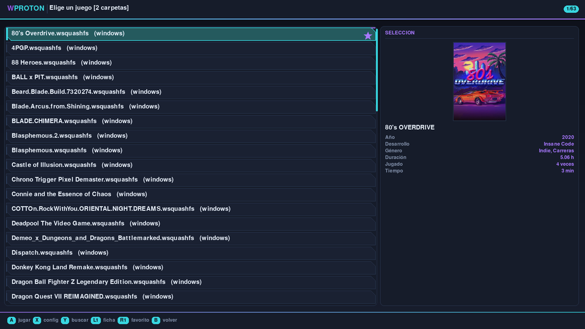
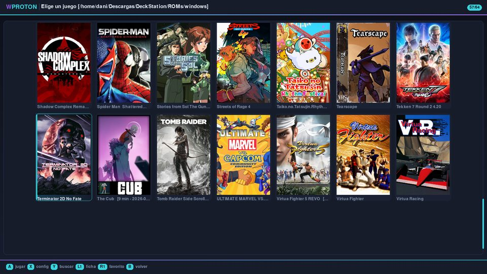

# WProton

**Lanzador portable de juegos de Windows para Linux, en un solo script.**

WProton monta, configura y lanza juegos de Windows —en formato `.wsquashfs`, `.dwarfs`, carpeta suelta o `.exe`— usando Proton o Wine, con menús que se manejan al 100% con el mando. Todo vive junto al script: runners, prefijos, Python, partidas y cachés. Cópialo a un pendrive y juega en otra máquina.

> **Versión actual: 1.15** — probado en CachyOS (KDE), SteamOS (Steam Deck y Legion Go S) y Batocera.



Inspirado en lo mejor de cuatro proyectos: los menús y tweaks de **PortProton/PortWINE**, la descarga automática de runners de **Heroic**, los perfiles por juego de **TeknoParrot** y el lanzamiento vía **umu** de **Faugus Launcher**.

📖 **[Manual de uso](MANUAL.md)** — cómo empezar, paso a paso.

---

## Qué sabe hacer

### Formatos de juego
- **`.wsquashfs` / `.squashfs`** — montaje con `squashfuse` + `fuse-overlayfs`: el juego queda en solo lectura y **las partidas se guardan aparte**, sin tocar el archivo original.
- **`.dwarfs`** — igual de rápido de montar, con bastante más compresión.
- **Carpetas sueltas** (incluidas las `.pc`), **`.exe`** y **`.bat`** — aparecen en la biblioteca y se juegan directamente, sin empaquetar nada.
- **Varias carpetas de juegos**: útil si los tienes repartidos entre discos.
- **Empaquetado autosuficiente**: un solo archivo con el juego y su prefijo dentro, listo para llevar a otro equipo.
- **Importación** de `zip`, `7z`, `rar` (incluido multiparte), `.wtgz` e **instaladores de GOG**, que se convierten al formato que elijas.
- **Prefijo incluido**: si el archivo trae su propio `drive_c` (estilo Batocera), se puede usar tal cual; si además trae su propio Wine, también.

### Menús con mando
- Lectura directa de `/dev/input`: funciona sin foco de ventana, con detección al vuelo, filtro de acelerómetros y soporte de crucetas de cualquier tipo.
- **Búsqueda** escribiendo con el teclado, o con el **teclado en pantalla** (botón Y), que también sirve para escribir argumentos, notas y variables.
- **Tres temas**: moderno (el predeterminado), clásico y arcade (synthwave con efecto CRT).
- **Menús persistentes**: todos los menús se dibujan en un mismo proceso, sin parpadeo al cambiar de uno a otro.
- **Vista de lista** (con carátula y datos del juego en el panel lateral) **o rejilla de carátulas**:


, con descarga automática desde SteamGridDB o eligiendo una imagen del sistema.
- Pantalla completa por defecto (**Select + A** para pasar a ventana) y tamaño de letra ajustable.
- Interfaz en **castellano e inglés**, ampliable con ficheros de idioma.

### Identificación de juegos
- Consulta la **base de datos de umu** para dar con el identificador que usa protonfixes.
- Al configurar un juego, muestra **todos** los ejecutables de la carpeta ordenados por probabilidad.
- **Ficha del juego** con año, editor, géneros y nota de Metacritic (datos de Steam, sin clave).

### Runners
- **Runner propio de WProton** (GE-Custom), que se instala de serie.
- Descarga desde el menú: **GE-Proton**, **Proton-CachyOS**, **DWProton**, **Wine-LG**, **Proton-LG**, **Wine-GE** y **Kron4ek**.
- **Auto-descarga**: si el perfil de un juego pide un runner que no tienes, se descarga solo antes de lanzar.
- En Batocera detecta los Wine del sistema y los de `/userdata/system/wine/custom`.

### Ajustes por juego
Runner, ejecutable, argumentos, prefijo (compartido, propio o incluido), GAMEID de protonfixes, y toggles de MangoHud, GameMode, Fsync/Esync, DXVK Async, WineD3D, FSR, LAA, Wayland, gamescope, DLL overrides, idioma, NTsync y **mando vía SDL** (en automático: se activa solo con los mandos que lo necesitan, como el DualSense).

Además: **notas**, **favoritos**, **estadísticas de tiempo jugado** y **copias de seguridad de las partidas**.

### Herramientas
winecfg, winetricks, redistribuibles de Windows (vcredist, PhysX, prerrequisitos de Unreal, DirectX…), **dgVoodoo2**, **OptiScaler** y **mapeador `.keys`** (mando → teclado, formato Batocera), que se activa solo si el juego tiene su fichero.

### Mantenimiento
- **Espacio en disco**: qué ocupa cada cosa, tamaño por juego, limpieza de cachés y detección de prefijos y partidas huérfanas.
- **Verificación de integridad** de los archivos y aviso de espacio insuficiente antes de importar.
- **Exportar/importar tu configuración** completa para pasar de máquina a máquina.
- **Auto-actualización** desde este repositorio, validando el fichero antes de reemplazar nada.

---

## Instalación

```bash
chmod +x wproton.sh
./wproton.sh --setup     # Python portable, pygame, umu y GE-Proton
./wproton.sh             # a jugar
```

La primera vez te preguntará dónde tienes los juegos; si no indicas nada, usará `games/` dentro de su propia carpeta.

### Requisitos

| Componente | Notas |
|---|---|
| `bash`, `curl`, `tar` | Presentes en cualquier distro |
| `fusermount3` (paquete `fuse3`) | **Del sistema**: lo exige el kernel para montar |
| `squashfuse`, `fuse-overlayfs` | WProton se descarga su propia copia portable (aunque el sistema las tenga) |
| `mksquashfs` / `mkdwarfs` | Solo para empaquetar; DwarFS se descarga solo |
| `7z` (`p7zip`) | Solo para importar `.7z` y `.rar` |
| Python + pygame | **Se instalan portables** con `--setup` |
| `evdev` (Python) | Para el mapeador `.keys`. En SteamOS, copia tu carpeta `evmapy/` a la raíz |

---

## Línea de comandos

```bash
./wproton.sh                        # menús
./wproton.sh juego.wsquashfs        # montar y jugar
./wproton.sh juego.dwarfs           # ídem
./wproton.sh juego.exe              # jugar directamente
./wproton.sh /ruta/carpeta          # jugar una carpeta
./wproton.sh juego.zip              # importar y jugar
./wproton.sh --import <exe|carpeta> # forzar el flujo probar/empaquetar
./wproton.sh --play                 # ir directo a la lista de juegos
./wproton.sh --menu                 # menú completo (salida del modo solo jugar)
./wproton.sh --setup                # (re)instalar el runtime
./wproton.sh --update               # buscar actualizaciones
./wproton.sh --version
```

Para integrarlo en un frontend (ES-DE, DeckStation…), apunta el lanzador a `wproton.sh %ROM%`.

## Controles

| Botón | Acción |
|---|---|
| Dpad / stick izquierdo | Moverse |
| **A** | Elegir / jugar |
| **B** | Volver, subir de carpeta o limpiar la búsqueda |
| **X** | Configurar el juego resaltado · marcar casillas · borrar letra |
| **L1** | Ficha del juego (año, editor, notas de la crítica) |
| **R1** | Marcar o quitar favorito |
| **Y** | Buscar (abre el teclado en pantalla) |
| **Select + A** | Pantalla completa / ventana |

Con teclado: flechas, Enter, Esc, F11 y **escribir directamente** para filtrar.

## Estructura de carpetas

```
wproton.sh              ← todo el programa
settings.conf           ← ajustes generales
profiles/               ← un .conf (y opcionalmente un .keys) por juego
lang/                   ← idiomas (en.json se genera solo)
covers/                 ← carátulas
backups/                ← copias de partidas y de tu configuración
runtime/                ← Python, runners, umu y herramientas
prefixes/               ← prefijos de Wine
wsquashfs/overlays/     ← TUS PARTIDAS (no borrar)
cache/  logs/  games/
```

`GAMES_PATH` admite rutas relativas: con `GAMES_PATH="ROMs/windows"` puedes mover la carpeta entera —o el pendrive— sin tocar nada.

## Problemas conocidos

- **Konsole no cierra su ventana** al terminar WProton si se lanzó desde ahí. WProton sí termina (el prompt vuelve), pero la ventana se queda abierta. En investigación; no afecta al uso normal ni al modo Juego.
- **Compartir perfiles de la comunidad**: la descarga funciona; el envío está desactivado mientras se decide un método cómodo para quien no usa Git.

## Créditos

- [PortProton / PortWINE](https://github.com/Castro-Fidel/PortWINE) — filosofía de menús y el arreglo del mando vía winebus.
- [umu-launcher](https://github.com/Open-Wine-Components/umu-launcher) y protonfixes.
- [GE-Proton](https://github.com/GloriousEggroll/proton-ge-custom), [Proton-CachyOS](https://github.com/CachyOS/proton-cachyos), [DWProton](https://dawn.wine), [Kron4ek](https://github.com/Kron4ek/Wine-Builds).
- [Batocera](https://batocera.org) — formatos `.wsquashfs` y `autorun.cmd`.
- [DwarFS](https://github.com/mhx/dwarfs), [innoextract](https://github.com/dscharrer/innoextract), [dgVoodoo2](https://github.com/dege-diosg/dgVoodoo2), [OptiScaler](https://github.com/cdozdil/OptiScaler), [SteamGridDB](https://www.steamgriddb.com).

## Licencia

*(Pendiente de elegir — GPL-3.0 encajaría con el ecosistema del que bebe el proyecto.)*
